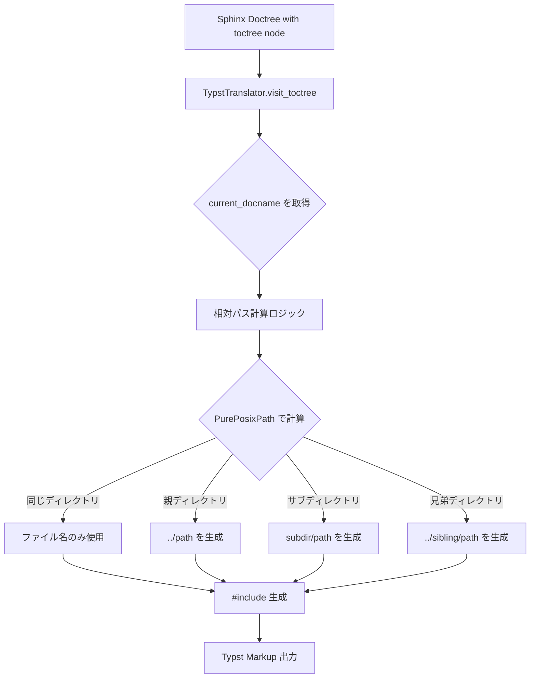
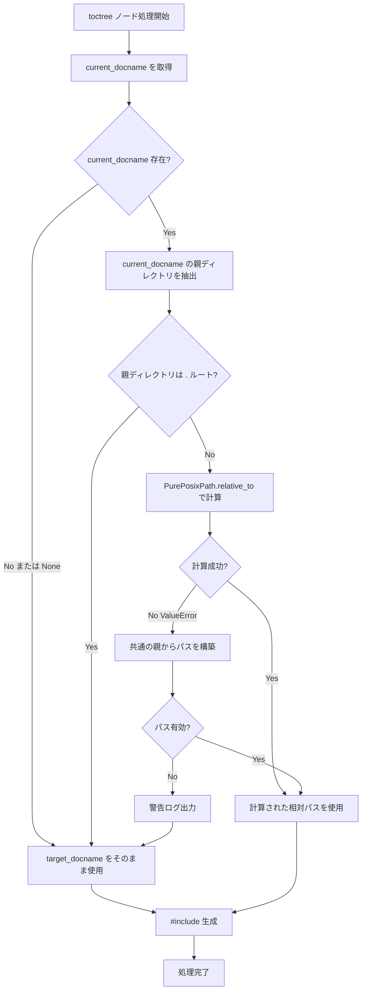
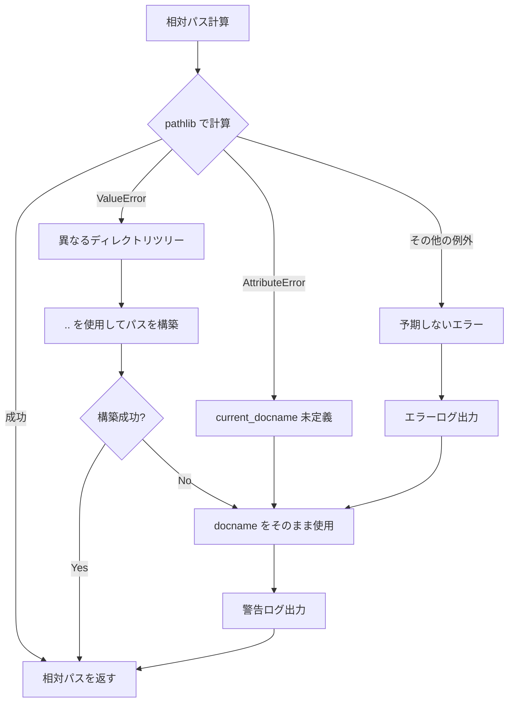
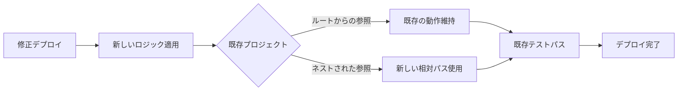

# 技術設計ドキュメント: ネストされたtoctreeの相対パス修正

## Overview

**目的**: この機能は、ネストされたtoctreeディレクティブにおける `#include()` パスの不正生成を修正し、サブディレクトリ内のドキュメントから同じディレクトリ内の他のドキュメントを正しく参照できるようにすることで、マルチレベルのドキュメント階層をサポートする。

**ユーザー**: Sphinx + sphinxcontrib-typstを使用してマルチレベルのドキュメント階層を持つプロジェクトを構築する開発者およびドキュメント作成者が、ネストされたディレクトリ構造でのドキュメント整理を行う際にこの機能を利用する。

**影響**: 現在のtoctree処理ロジック（`TypstTranslator.visit_toctree`メソッド876行目）を変更し、プロジェクトルートからの絶対パスではなく、現在のドキュメントからの相対パスを計算して `#include()` ディレクティブを生成するように修正する。

### Goals

- サブディレクトリ内のドキュメントから同じディレクトリ内のドキュメントへのtoctree参照を正しく処理
- 既存の動作（ルートディレクトリからの参照）との後方互換性を完全に維持
- Typstコンパイラでエラーなくコンパイル可能なTypstファイルを生成
- 成功基準: Issue #5のテストケースがパス、既存の286テストがすべてパス、コードカバレッジ93%以上を維持

### Non-Goals

- toctree以外のディレクティブ（`image`、`literalinclude`など）における相対パス処理の実装
- シンボリックリンクやハードリンクのサポート
- プロジェクトルート外のファイル参照
- 絶対パス指定（`/`で始まるパス）のサポート
- Typstの `#include()` 以外のインポート機能（`#import`など）のサポート

## Architecture

### 既存アーキテクチャの分析

**現在のアーキテクチャパターンと制約**:
- **Visitor パターン**: `TypstTranslator` は `SphinxTranslator` を継承し、Doctreeノードを訪問して Typst マークアップに変換
- **責務の分離**: Builder（ビルドプロセス管理）、Writer（変換オーケストレーション）、Translator（ノード変換ロジック）が明確に分離
- **既存のtoctree処理**: `visit_toctree()`メソッドで `docname` をそのまま使用して `#include("{docname}.typ")` を生成

**尊重すべき既存ドメイン境界**:
- **TypstTranslator**: Doctreeノードの Typst マークアップへの変換（修正対象）
- **TypstBuilder**: ドキュメントビルドプロセス管理、`current_docname` の提供
- **境界の維持**: Builder と Translator の責務を混同しない

**維持すべき統合ポイント**:
- `self.builder.current_docname`: 現在処理中のドキュメント名を取得（Builder から提供）
- `toctree` ノードの `entries` 属性: toctreeエントリのリスト取得
- `self.add_text()`: Typstマークアップの出力
- `nodes.SkipNode`: 子ノードの処理をスキップ

**対処する技術的負債**:
- 現在の実装は docname（プロジェクトルートからのパス）をそのまま使用しており、ネストされたディレクトリ構造を考慮していない
- この修正により、将来的な相対パス処理の基盤を構築

### High-Level Architecture



**アーキテクチャ統合**:
- **既存パターンの保持**: Visitor パターンを維持し、`visit_toctree()` メソッド内で実装
- **新規コンポーネントの根拠**: なし（既存メソッドの内部ロジックのみ変更、プライベートヘルパーメソッド `_compute_relative_include_path()` を追加）
- **技術スタック整合性**: Python 3.9+ の `pathlib.PurePosixPath` を使用（モダンなPythonスタイル、要件で明示）
- **ステアリング準拠**:
  - `structure.md`: Visitor パターンの型安全性原則に準拠
  - `tech.md`: pathlib の積極利用推奨に準拠
  - `product.md`: 高品質実装（テストカバレッジ93%維持）に準拠

### 技術スタック整合性

**既存システムへの拡張**として、以下の技術を使用:

- **Python標準ライブラリ - pathlib.PurePosixPath**:
  - **選択理由**:
    - Sphinx の docname は常に POSIX スタイルのパス（`/` 区切り）
    - OS 非依存で一貫した動作を保証（Windows でも `/` 区切り）
    - モダンでオブジェクト指向なパス操作
    - 要件で明示的に pathlib の積極利用を指定
  - **代替案考慮**:
    - `os.path.relpath()`: OS依存、レガシー、Windows で `\` 区切りになる可能性
    - `pathlib.Path`: OS依存、Windows環境で問題の可能性
    - 手動文字列操作: エラー発生しやすい、保守性低い

**新規依存関係**: なし（Python標準ライブラリのみ）

### 主要設計決定

#### Decision 1: PurePosixPath による相対パス計算

**決定**: `pathlib.PurePosixPath` を使用した OS 非依存な相対パス計算

**コンテキスト**:
- Sphinx の docname は常に POSIX スタイル（`/` 区切り）
- Windows環境でも docname は POSIX 形式で統一
- Typst は POSIX スタイルのパスを期待
- クロスプラットフォーム互換性が必須

**代替案**:
1. `os.path.relpath()`: OS依存、Windowsで `\` 区切りになるリスク
2. `pathlib.Path`: OS依存、実行環境によって動作が変わる
3. 手動文字列操作: エラー発生しやすい、複雑なエッジケース処理が必要

**選択されたアプローチ**:
```python
from pathlib import PurePosixPath

def _compute_relative_include_path(
    self,
    target_docname: str,
    current_docname: str | None
) -> str:
    """相対パスを計算"""
    if not current_docname:
        # current_docname が None の場合は絶対パスを使用
        return target_docname

    current_path = PurePosixPath(current_docname)
    target_path = PurePosixPath(target_docname)
    current_dir = current_path.parent

    # ルートディレクトリの場合
    if current_dir == PurePosixPath("."):
        return target_docname

    # 相対パスを計算
    try:
        relative_path = target_path.relative_to(current_dir)
        return str(relative_path)
    except ValueError:
        # 異なるディレクトリツリーの場合、共通の親からの相対パスを構築
        # 1. current_dir から共通の親までの深さを計算（../ の数）
        # 2. 共通の親から target_path への相対パスを取得
        # 3. "../" * depth + relative_from_common を結合

        current_parts = current_dir.parts
        target_parts = target_path.parts

        # 共通の親を見つける
        common_length = 0
        for i, (c, t) in enumerate(zip(current_parts, target_parts)):
            if c == t:
                common_length = i + 1
            else:
                break

        # current_dir から共通の親への "../" を構築
        up_count = len(current_parts) - common_length
        up_path = "../" * up_count if up_count > 0 else ""

        # 共通の親から target への相対パス
        down_parts = target_parts[common_length:]
        down_path = "/".join(down_parts) if down_parts else ""

        relative_path = up_path + down_path
        return str(relative_path)
```

**根拠**:
- **クロスプラットフォーム互換性**: POSIX パス形式を保証
- **Typst互換性**: `/` 区切りのパスを常に生成
- **保守性**: オブジェクト指向API、可読性が高い
- **要件準拠**: pathlib の積極利用を明示

**トレードオフ**:
- **獲得**: クロスプラットフォーム互換性、一貫性、保守性
- **犠牲**: わずかな学習コスト（PurePosixPathの理解）、ただしドキュメントが豊富

#### Decision 2: 後方互換性保証戦略

**決定**: 計算された相対パスが既存の動作と一致する場合は同じ出力を生成

**コンテキスト**:
- 既存の286テストケースを破壊してはいけない
- ルートディレクトリからのtoctree参照は現在正しく動作
- 既存プロジェクトへの影響をゼロにする必要

**代替案**:
1. 常に相対パスを計算: 既存の出力が変わる可能性
2. 設定オプションで切り替え: 複雑性増加、デフォルト値の選択が困難
3. バージョン指定で動作切り替え: 移行期間の管理が複雑

**選択されたアプローチ**:
- ルートディレクトリからの参照の場合、計算された相対パスは `docname` と同じになるため、出力は変わらない
- サブディレクトリからの参照の場合のみ、新しい相対パス計算ロジックを適用
- 条件分岐は最小限（`current_dir` が `.` かどうかのチェックのみ）

**根拠**:
- **ゼロ破壊変更**: 既存プロジェクトへの影響なし
- **シンプル**: 条件分岐が最小限
- **テスト保証**: 既存テストが自動的に後方互換性を検証

**トレードオフ**:
- **獲得**: 既存プロジェクトへの影響ゼロ、段階的ロールアウト不要
- **犠牲**: わずかな条件分岐の複雑さ（ただし最小限）

#### Decision 3: エラーハンドリング戦略

**決定**: グレースフルデグラデーションによるフォールバック

**コンテキスト**:
- パス計算失敗時にビルド全体を中断すべきではない
- デバッグのための詳細なロギングが必要
- ユーザーに対して親切なエラーメッセージ

**代替案**:
1. 厳格なエラー: パス計算失敗時にビルドを中断（ユーザー体験が悪い）
2. サイレント失敗: エラーを無視（デバッグ困難）
3. 警告のみ: エラーを記録するが処理は続行（混乱を招く可能性）

**選択されたアプローチ**:
```python
try:
    relative_path = self._compute_relative_include_path(docname, current_docname)
except Exception as exc:
    logger.warning(
        f"Failed to compute relative path from {current_docname} to {docname}: {exc}. "
        f"Using absolute path instead.",
        location=current_docname
    )
    relative_path = docname  # フォールバック
```

**根拠**:
- **ユーザー体験**: ビルドが失敗しない
- **デバッグ可能性**: 警告ログで問題を特定可能
- **安全性**: 最悪の場合でも既存の動作にフォールバック

**トレードオフ**:
- **獲得**: 堅牢性、ユーザー体験、デバッグ可能性
- **犠牲**: エラーの隠蔽リスク（ただし警告ログで軽減）

## System Flows

### 相対パス計算フロー



### エラーハンドリングフロー



## Requirements Traceability

| 要件 | 要件概要 | コンポーネント | インターフェース | フロー |
|------|---------|--------------|-------------|-------|
| 1.1 | 現在のドキュメント位置取得 | TypstTranslator | `self.builder.current_docname` | 相対パス計算フロー |
| 1.2 | サブディレクトリパス抽出 | TypstTranslator | `PurePosixPath(docname).parent` | 相対パス計算フロー |
| 1.3 | 相対パス計算 | TypstTranslator | `_compute_relative_include_path()` | 相対パス計算フロー |
| 1.4 | 同じディレクトリでファイル名のみ | TypstTranslator | `PurePosixPath.relative_to()` | 相対パス計算フロー |
| 1.5 | 異なるディレクトリで相対パス | TypstTranslator | クロスディレクトリパス構築ロジック | 相対パス計算フロー |
| 2.1-2.3 | 既存機能互換性 | TypstTranslator | ルートディレクトリ検出ロジック | 相対パス計算フロー |
| 3.1-3.3 | ネストされたtoctreeサポート | TypstTranslator | 新しい相対パス計算ロジック | 相対パス計算フロー |
| 4.1-4.3 | Typstコンパイル検証 | テストスイート | pytest統合テスト + Typst CLI | E2Eテスト |
| 5.1-5.3 | テストカバレッジ | テストスイート | 新規ユニット・統合テスト | テスト実行 |

## Components and Interfaces

### Doctree to Typst Translation Layer

#### TypstTranslator

**責務と境界**
- **主要責務**: Sphinx Doctree ノードを Typst マークアップに変換（単一責任）
- **ドメイン境界**: ドキュメント変換層（Sphinxエコシステムとの境界）
- **データ所有権**: 変換中の Typst マークアップ文字列（`self.body`）
- **トランザクション境界**: なし（ステートレスな変換処理、副作用なし）

**依存関係**
- **インバウンド**: Sphinx Builder が Doctree を提供、Writer が変換を要求
- **アウトバウンド**: なし（Typst マークアップ文字列を生成するのみ）
- **外部**: Python 標準ライブラリ `pathlib.PurePosixPath`（OS非依存）

**外部依存関係の調査**:
- `pathlib.PurePosixPath`: Python 3.4+ で利用可能、Python 3.9+ で安定
- 公式ドキュメント: https://docs.python.org/3/library/pathlib.html
- 既知の問題: なし（成熟したAPI）
- パフォーマンス: O(n) - パス要素数に比例、通常数個なので無視できる

**契約定義**

**サービスインターフェース** (修正対象メソッド):

```python
from typing import NoReturn
from pathlib import PurePosixPath
from docutils import nodes

class TypstTranslator(SphinxTranslator):
    def visit_toctree(self, node: nodes.Node) -> NoReturn:
        """
        toctree ノードを訪問し、#include() ディレクティブを生成

        事前条件:
        - node は有効な toctree ノードである
        - node["entries"] が存在する（空リストでも可）
        - self.builder.current_docname が存在する（Noneでも可）

        事後条件:
        - 各エントリに対して正しい相対パスの #include() が生成される
        - nodes.SkipNode が発生する（子ノードの処理をスキップ）
        - 既存のテストケースの出力は変更されない（後方互換性）

        不変条件:
        - ルートディレクトリからの参照は既存の動作を維持
        - self.body の状態は変換前後で一貫性を保つ

        Raises:
            nodes.SkipNode: 常に発生（仕様）
        """
        ...

    def _compute_relative_include_path(
        self,
        target_docname: str,
        current_docname: str | None
    ) -> str:
        """
        toctree エントリの相対パスを計算

        Args:
            target_docname: toctreeエントリのドキュメント名（例: "chapter1/section1"）
            current_docname: 現在のドキュメント名（例: "chapter1/index"）、None可

        Returns:
            相対パス文字列（例: "section1" または "../other/doc"）

        事前条件:
        - target_docname は空文字列ではない
        - target_docname は有効なPOSIX形式のパス

        事後条件:
        - 返されるパスは Typst が解決可能な POSIX 形式
        - current_docname が None の場合、target_docname をそのまま返す
        - ルートディレクトリからの参照の場合、target_docname をそのまま返す

        例:
            >>> _compute_relative_include_path("chapter1/section1", "chapter1/index")
            "section1"
            >>> _compute_relative_include_path("chapter2/doc", "chapter1/index")
            "../chapter2/doc"
            >>> _compute_relative_include_path("chapter1/doc", None)
            "chapter1/doc"
        """
        ...
```

**統合戦略**:
- **修正アプローチ**: 既存の `visit_toctree()` メソッドを拡張（最小限の変更）
- **後方互換性**:
  - 既存のテストケースの出力を変更しない
  - ルートディレクトリからの参照は既存の動作を維持
- **移行パス**: 即座に新しいロジックを適用（段階的移行は不要、後方互換性を保証）

## Error Handling

### エラー戦略

相対パス計算における具体的なエラーハンドリングパターン:

1. **グレースフルデグラデーション**: エラー時は既存の動作（絶対パス）にフォールバック
2. **詳細なロギング**: デバッグのための警告メッセージ出力（Sphinx logging使用）
3. **ユーザー体験優先**: ビルドを中断せず、問題箇所を特定可能にする

### エラーカテゴリと対応

**システムエラー** (予期しない状態):

**ValueError (pathlib計算失敗)**:
- **原因**: 異なるディレクトリツリー間の `relative_to()` 呼び出し
- **検出**: `try-except ValueError` で捕捉
- **対応**: 共通の親ディレクトリから相対パスを手動で構築
- **フォールバック**: 構築失敗時は `target_docname` をそのまま使用
- **ロギング**: 警告レベルで詳細を記録

**AttributeError (current_docname未定義)**:
- **原因**: Builder に `current_docname` 属性が存在しない（予期しない状態）
- **検出**: `getattr(self.builder, 'current_docname', None)` で安全に取得
- **対応**: None チェックで検出し、絶対パスにフォールバック
- **フォールバック**: `target_docname` をそのまま使用
- **ロギング**: デバッグレベルで記録

**ビジネスロジックエラー** (入力検証):

**空のtoctree entries**:
- **検出**: `if not entries` チェック（既存ロジック）
- **対応**: `nodes.SkipNode` を発生させて処理をスキップ
- **ユーザーへの影響**: なし（空のtoctreeは何も生成しない、仕様通り）

### エラーハンドリングフロー

（前述の「エラーハンドリングフロー」Mermaid図を参照）

### モニタリング

**ロギング戦略**:
```python
from sphinx.util import logging

logger = logging.getLogger(__name__)

# 警告レベル: フォールバック発生時
logger.warning(
    f"Failed to compute relative path from '{current_docname}' to '{target_docname}': {exc}. "
    f"Using absolute path '{target_docname}' instead.",
    location=current_docname,
    type="toctree",
    subtype="relative_path"
)

# デバッグレベル: 正常な相対パス計算
logger.debug(
    f"Computed relative path: {current_docname} -> {target_docname} = {relative_path}",
    type="toctree"
)
```

**ヘルスチェック**: なし（ビルド時の一時的な処理、永続的なサービスではない）

**メトリクス**: なし（デバッグログのみで十分）

## Testing Strategy

### ユニットテスト

**新規テストファイル**: `tests/test_nested_toctree_paths.py`

1. **相対パス計算ロジック**:
   - `test_compute_relative_path_same_directory`:
     - 入力: `("chapter1/section1", "chapter1/index")`
     - 期待: `"section1"`
   - `test_compute_relative_path_parent_directory`:
     - 入力: `("index", "chapter1/section1")`
     - 期待: `"../index"`
   - `test_compute_relative_path_sibling_directory`:
     - 入力: `("chapter2/doc", "chapter1/index")`
     - 期待: `"../chapter2/doc"`
   - `test_compute_relative_path_nested_subdirectory`:
     - 入力: `("chapter1/sub/doc", "chapter1/index")`
     - 期待: `"sub/doc"`

2. **エッジケース**:
   - `test_compute_relative_path_none_current_docname`:
     - 入力: `("chapter1/doc", None)`
     - 期待: `"chapter1/doc"` (フォールバック)
   - `test_compute_relative_path_root_document`:
     - 入力: `("chapter1/doc", "index")`
     - 期待: `"chapter1/doc"` (ルートからは絶対パス)
   - `test_compute_relative_path_deep_nesting`:
     - 入力: `("a/b/c/d/e", "a/b/x/y")`
     - 期待: `"../../c/d/e"`

3. **PurePosixPath の動作確認**:
   - `test_purepath_windows_compatibility`:
     - Windows環境でも `/` 区切りを使用することを確認

### 統合テスト

**新規テストファイル**: `tests/test_integration_nested_toctree.py`

**新規フィクスチャ**: `tests/fixtures/integration_nested_toctree/`

1. **Issue #5 の再現**:
   - ディレクトリ構造:
     ```
     integration_nested_toctree/
     ├── conf.py
     ├── index.rst (toctree: chapter1/index)
     └── chapter1/
         ├── index.rst (toctree: section1, section2)
         ├── section1.rst
         └── section2.rst
     ```
   - ファイル内容例:
     ```restructuredtext
     # index.rst
     .. toctree::

        chapter1/index

     # chapter1/index.rst
     .. toctree::

        section1
        section2
     ```
   - 期待される出力:
     ```typst
     // index.typ
     #include("chapter1/index.typ")

     // chapter1/index.typ
     #include("section1.typ")
     #include("section2.typ")
     ```
   - 検証項目:
     - `chapter1/index.typ` に `#include("section1.typ")` が生成される (相対パス)
     - `chapter1/index.typ` に `#include("section2.typ")` が生成される (相対パス)
     - `index.typ` に `#include("chapter1/index.typ")` が生成される (ルートから)

2. **複数レベルのネスト**:
   - ディレクトリ構造:
     ```
     integration_multi_level/
     ├── index.rst
     └── part1/
         ├── index.rst
         └── chapter1/
             ├── index.rst
             ├── section1.rst
             └── section2.rst
     ```
   - ファイル内容例:
     ```restructuredtext
     # part1/chapter1/index.rst
     .. toctree::

        section1
        section2
     ```
   - 期待される出力:
     ```typst
     // part1/chapter1/index.typ
     #include("section1.typ")
     #include("section2.typ")
     ```
   - 検証: 3階層のネストで正しい相対パスが生成される

3. **兄弟ディレクトリ間の参照**:
   - ディレクトリ構造:
     ```
     integration_sibling/
     ├── index.rst
     ├── chapter1/
     │   └── doc1.rst (toctree: ../chapter2/doc2)
     └── chapter2/
         └── doc2.rst
     ```
   - ファイル内容例:
     ```restructuredtext
     # chapter1/doc1.rst
     .. toctree::

        ../chapter2/doc2
     ```
   - 期待される出力:
     ```typst
     // chapter1/doc1.typ
     #include("../chapter2/doc2.typ")
     ```
   - 検証: `chapter1/doc1.typ` に `#include("../chapter2/doc2.typ")` が生成される (兄弟ディレクトリへの相対パス)

### E2E / Typstコンパイルテスト

**既存テストに追加**: `tests/test_pdf_generation.py`

1. **Typstコンパイル検証**:
   - `test_nested_toctree_compiles_successfully`:
     - 手順:
       1. `integration_nested_toctree` フィクスチャで Sphinx ビルド
       2. `typst compile` で PDF 生成を試行（`subprocess.run`）
       3. コンパイルが成功することを確認（`returncode == 0`）
       4. 生成されたPDFが存在することを確認
     - 環境: `typst` CLI が利用可能な場合のみ実行（`pytest.mark.skipif`）

2. **クロスプラットフォーム検証**:
   - CI/CD で Linux, macOS, Windows で自動実行
   - GitHub Actions matrix strategy 使用

### 既存機能の回帰テスト

**既存テストスイート**: 286テストすべてがパスすることを確認

- `tests/test_integration_basic.py`: 基本的なtoctree（ルートディレクトリから）
- `tests/test_integration_multi_doc.py`: 複数ドキュメントの統合
- `tests/test_toctree_requirement13.py`: toctree要件のユニットテスト

**検証方法**:
```bash
uv run pytest -v --cov=sphinxcontrib.typst --cov-report=term-missing
```

**成功基準**:
- すべての既存テストがパス（286/286）
- コードカバレッジ93%以上を維持
- 新規テストケースを含めてカバレッジを向上

## Migration Strategy

**移行不要**: この修正は既存のコードベースへの拡張であり、以下の理由で移行戦略は不要:

### 即座の適用



### 理由

1. **即座の適用**: 新しいロジックは既存のメソッド内で実装され、デプロイ時に即座に適用
2. **後方互換性**: 既存のtoctreeパターンは同じ出力を生成（条件分岐で保証）
3. **データ移行不要**: 生成されるファイルは一時的なビルド成果物（ソースファイルは変更不要）
4. **ロールバック**: 問題発生時は修正前のバージョンに戻すだけ（データ損失なし）

### 検証手順

**フェーズ1: 開発環境での検証**
1. 既存のテストスイート（286テスト）がすべてパスすることを確認
2. 新規テストケース（ネストされたtoctree）がパスすることを確認
3. コードカバレッジが93%以上を維持することを確認

**フェーズ2: 統合テスト**
1. Issue #5 で報告された実際のプロジェクトでビルドを実行
2. 生成されたTypstファイルの内容を検証（相対パスが正しいか）
3. Typst CLI でコンパイルし、PDFが正常に生成されることを確認

**フェーズ3: ベータテスト**
1. ベータ版（v0.1.0b2）として PyPI にリリース
2. ユーザーからのフィードバックを収集（1-2週間）
3. エッジケースを特定し、必要に応じて修正

**フェーズ4: 正式リリース**
1. 次のマイナーバージョン（v0.2.0）で正式リリース
2. CHANGELOG.md に修正内容を記載
3. ドキュメント（usage.rst）に新しい動作を追記

### ロールバックトリガー

以下の場合はロールバックを実施:
- 既存のテストケースが失敗（後方互換性の破壊）
- コードカバレッジが90%未満に低下
- クリティカルなバグ報告（ビルド失敗、誤ったパス生成）

### 検証チェックポイント

- [ ] 既存の286テストがすべてパス
- [ ] 新規ユニットテスト（8テスト）がすべてパス
- [ ] 新規統合テスト（3フィクスチャ）がすべてパス
- [ ] E2E Typstコンパイルテストがパス
- [ ] コードカバレッジ93%以上を維持
- [ ] Issue #5 の実際のケースでビルド成功
- [ ] クロスプラットフォームテスト（Linux/macOS/Windows）成功
