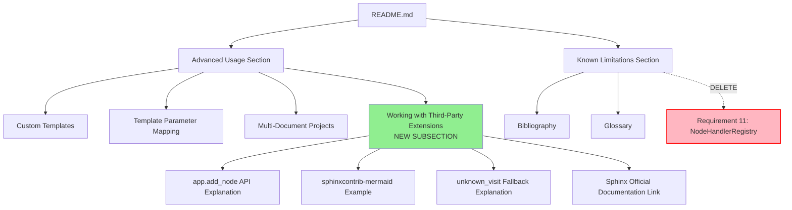

# Technical Design Document: remove-nodehandlerregistry-docs

## Overview

このfeatureは、Issue #6で指摘された「NodeHandlerRegistryが不要」という事実をユーザーに正しく伝えるため、README.mdにカスタムノード対応ガイドを追加し、誤解を招く記述を修正する。Sphinxは既に`app.add_node()` APIを提供しており、独自のレジストリ実装は不要である。

**Purpose**: サードパーティ拡張（sphinxcontrib-mermaidなど）を使用するユーザーに、正しいカスタムノード登録方法を文書化する。

**Users**: sphinxcontrib-typstユーザーで、サードパーティSphinx拡張との統合を検討している開発者。

**Impact**: README.mdの「Known Limitations」セクションから誤った記述を削除し、新しい「Working with Third-Party Extensions」セクションを追加することで、ユーザーがSphinxの標準APIを使った正しいアプローチを理解できるようになる。

### Goals

- README.mdにカスタムノード対応ガイドを追加し、`app.add_node()` APIの使用方法を説明する
- 「Known Limitations」セクションから「Requirement 11が未実装」という誤った記述を削除する
- SphinxのNode登録メカニズムを技術的に正確に文書化する

### Non-Goals

- コード実装の変更（現在の実装は既に正しい）
- `.kiro/specs/sphinxcontrib-typst/`配下の初期構築用仕様書の修正（歴史的記録として保持）
- docs/ディレクトリ内のrst形式ドキュメントの追加（README.mdで十分）

## Architecture

### Existing Architecture Analysis

**Current Documentation Structure**:
- README.mdは11の主要セクションで構成されている
- 「Advanced Usage」セクション（lines 123-168）にサブセクションがある
- 「Known Limitations」セクション（lines 228-234）に誤った記述が含まれている

**Modification Approach**:
- **Extend existing structure**: Advanced Usageセクションに新しいサブセクションを追加
- **Minimal changes**: 既存のセクション構造と書式を維持
- **Backward compatibility**: 既存のリンクとアンカーは影響を受けない

### High-Level Architecture



### Technology Alignment

**Document Format**: Markdown（既存のREADME.md形式を維持）
**Content Style**:
- コード例にはPython Syntax highlighting
- conf.py設定例の形式を既存セクションと統一
- Sphinxドキュメントへのリンク形式を統一

**Existing Patterns Preserved**:
- セクション見出し: `##` for main sections, `###` for subsections
- コードブロック: ` ```python ` with proper indentation
- リスト形式: `- **Bold Title**: Description`
- リンク: `[text](URL)` Markdown format

## Key Design Decisions

### Decision 1: Advanced Usageセクション内に追加 vs 独立セクション

**Context**: カスタムノード対応ガイドをREADME.mdのどこに配置すべきか。

**Alternatives**:
1. Advanced Usageセクション内にサブセクションとして追加
2. Advanced UsageとConfiguration Optionsの間に独立セクションを作成
3. Known Limitationsセクションを書き換えてカスタムノード対応を説明

**Selected Approach**: Option 1 - Advanced Usageセクション内にサブセクションとして追加

**Rationale**:
- カスタムノード対応は「高度な使用方法」の一部である
- 既存の3つのサブセクション（Custom Templates, Template Parameter Mapping, Multi-Document Projects）と論理的に並ぶ
- ユーザーは自然に発見できる位置にある
- README.mdの全体構造への影響が最小限

**Trade-offs**:
- **Gain**: 最小限の変更、論理的な配置、既存構造との整合性
- **Sacrifice**: 独立セクションに比べて目立たない（ただし、高度な機能のため問題ない）

### Decision 2: コード例の詳細度

**Context**: sphinxcontrib-mermaidの統合例をどの程度詳しく書くべきか。

**Alternatives**:
1. 最小限の例（mermaidノードの登録のみ）
2. 詳細な例（SVGエクスポート、ファイルパス処理を含む）
3. 複数の例（mermaid + 他の拡張）

**Selected Approach**: Option 1 - 最小限の例（mermaidノードの登録のみ）

**Rationale**:
- README.mdは概要ドキュメントであり、詳細な実装ガイドではない
- ユーザーは実際の実装時にSphinx公式ドキュメントを参照できる
- シンプルな例の方が理解しやすい
- 必要に応じて将来的にdocs/ディレクトリに詳細ガイドを追加できる

**Trade-offs**:
- **Gain**: 読みやすさ、保守性、README.mdの簡潔さ維持
- **Sacrifice**: 実践的な詳細（ただし、Sphinx公式ドキュメントへのリンクでカバー）

### Decision 3: Known Limitationsの削除 vs 書き換え

**Context**: 「Requirement 11が未実装」という記述をどう扱うべきか。

**Alternatives**:
1. 完全に削除
2. 書き換えて「Requirement 11は実装済み（Sphinxの標準APIで対応）」と説明
3. コメントアウトして履歴として残す

**Selected Approach**: Option 1 - 完全に削除

**Rationale**:
- Requirement 11は実装済みであり、制限事項ではない
- 「Working with Third-Party Extensions」セクションで正しいアプローチを説明済み
- Known Limitationsは「現在できないこと」を示すセクションである
- Gitの履歴に残るため、完全削除でも問題ない

**Trade-offs**:
- **Gain**: 正確性、混乱の排除、ドキュメントのクリーンさ
- **Sacrifice**: なし（削除が正しい対応）

## Components and Interfaces

### README.md Documentation Component

#### Responsibility & Boundaries

**Primary Responsibility**: プロジェクト概要とクイックスタートガイドを提供する

**Domain Boundary**: ユーザー向けドキュメント（エンドユーザー）

**Data Ownership**: READMEコンテンツ（プロジェクトメタデータ、使用例、設定ガイド）

#### Dependencies

**Inbound**: なし（エントリーポイントドキュメント）

**Outbound**:
- `docs/` directory（詳細ドキュメントへのリンク）
- Sphinx公式ドキュメント（外部リンク）
- PyPI（バッジとインストールガイド）

#### New Section: Working with Third-Party Extensions

**挿入位置**: lines 168-169（Multi-Document Projectsサブセクションの直後）

**Content Structure**:
```markdown
### Working with Third-Party Extensions

[導入段落: Sphinxの標準メカニズムの説明]

[コード例: conf.py での app.add_node() 使用]

[動作説明: 3つのポイント]

[参考リンク: Sphinx公式ドキュメント]
```

**Complete Markdown Content**:
```markdown
### Working with Third-Party Extensions

sphinxcontrib-typst integrates with Sphinx's standard extension mechanism. For custom nodes from third-party extensions (e.g., sphinxcontrib-mermaid), you can register Typst handlers in your `conf.py`:

\`\`\`python
# conf.py
def setup(app):
    # Example: Support sphinxcontrib-mermaid diagrams
    if 'sphinxcontrib.mermaid' in app.config.extensions:
        from sphinxcontrib.mermaid import mermaid
        from docutils import nodes

        def typst_visit_mermaid(self, node):
            """Render Mermaid diagram as image in Typst output"""
            # Export diagram as SVG and include in Typst
            diagram_path = f"diagrams/{node['name']}.svg"
            self.add_text(f'#image("{diagram_path}")\n\n')
            raise nodes.SkipNode

        # Register with Sphinx's standard API
        app.add_node(mermaid, typst=(typst_visit_mermaid, None))
\`\`\`

**How it works**:
- sphinxcontrib-typst uses Sphinx's standard `app.add_node()` API (no custom registry needed)
- Unknown nodes trigger `unknown_visit()` which logs a warning and extracts text content
- Users can add Typst support for any extension by registering handlers in `conf.py`

For more details, see the [Sphinx Extension API documentation](https://www.sphinx-doc.org/en/master/extdev/appapi.html#sphinx.application.Sphinx.add_node).
```

#### Modified Section: Known Limitations

**削除する内容** (line 230):
```markdown
- **Requirement 11** (Extensibility and Plugin Support): Custom node handler registry not yet implemented (planned for v0.2.0)
```

**修正後の内容**:
```markdown
## Known Limitations (v0.1.0b1)

- **Bibliography**: BibTeX integration not yet supported
- **Glossary**: Glossary generation not yet supported

See full requirements verification in project documentation.
```

## Testing Strategy

### Documentation Quality Tests

**Manual Review Checklist**:
1. **Markdownレンダリング確認**: GitHubプレビューで表示を確認
2. **コードブロックのSyntax**: Python highlightingが正しく適用されるか
3. **リンク検証**: Sphinx公式ドキュメントURLが有効か
4. **一貫性チェック**: 既存のAdvanced Usageサブセクションとのスタイル統一

**Content Accuracy Tests**:
1. **コード例の検証**: `app.add_node()`の構文が正しいか
2. **API参照の正確性**: Sphinx APIドキュメントへのリンクが最新版を指しているか
3. **用語の一貫性**: "custom node", "third-party extension", "unknown_visit()" の表記統一

**User Experience Tests**:
1. **可読性**: 非ネイティブスピーカーでも理解できるか
2. **実行可能性**: ユーザーがコード例をそのまま使えるか
3. **発見可能性**: Advanced Usageセクションから自然に見つけられるか

### Integration Tests (Optional)

**実際の統合テスト** (実装フェーズで実行可能):
1. サンプルプロジェクトでsphinxcontrib-mermaidと統合
2. README.mdのコード例をconf.pyにコピー＆ペースト
3. `sphinx-build -b typst`でビルドし、Typst出力を確認

## Requirements Traceability

| Requirement | Requirement Summary | Modified Sections | Validation Method |
|-------------|---------------------|-------------------|-------------------|
| 1.1 | サードパーティ拡張との連携方法を説明するセクション | Working with Third-Party Extensions (new) | Manual review of section content |
| 1.2 | `app.add_node()` APIを使った実装例を提供 | Working with Third-Party Extensions (code example) | Syntax validation, Sphinx API reference check |
| 1.3 | `conf.py`での具体的なコード例を含む | Working with Third-Party Extensions (conf.py example) | Code block formatting, executability check |
| 1.4 | `typst=(visit_func, depart_func)`の形式を示す | Working with Third-Party Extensions (code example line) | API signature validation |
| 1.5 | `unknown_visit()`のフォールバック動作を説明 | Working with Third-Party Extensions (How it works section) | Content accuracy review |
| 2.1 | 「Requirement 11が未実装」という記述を含まない | Known Limitations (line 230 deleted) | Grep check for removed text |
| 2.2 | 「NodeHandlerRegistryは不要」であることを明記 | Working with Third-Party Extensions (How it works) | Content presence validation |
| 2.3 | 「Sphinxの標準APIで十分」という理由を説明 | Working with Third-Party Extensions (How it works) | Explanation clarity review |
| 3.1 | `app.add_node()`がSphinxの標準APIであることを明記 | Working with Third-Party Extensions (How it works) | Terminology accuracy check |
| 3.2 | ビルダーごとにvisitor関数を登録する方法を説明 | Working with Third-Party Extensions (code example) | Code example completeness |
| 3.3 | 「ビルダー側で独自レジストリは不要」と明記 | Working with Third-Party Extensions (How it works) | Negative statement validation |
| 3.4 | `unknown_visit()`が警告を出力しテキストを抽出 | Working with Third-Party Extensions (How it works) | Fallback behavior explanation |
| 3.5 | Sphinx公式ドキュメントへのリンクを提供 | Working with Third-Party Extensions (link) | URL validity check |

## Implementation Summary

**Modified File**: `README.md`

**Changes**:
1. **Addition** (after line 168): New subsection "Working with Third-Party Extensions" (約30行)
2. **Deletion** (line 230): "Requirement 11" entry from Known Limitations (1行)

**Total Impact**:
- Lines added: ~30
- Lines deleted: 1
- Net change: +29 lines
- Modification complexity: **Extra Small (XS)**

**Implementation Time**: 30分〜1時間（Markdown編集、レビュー、検証含む）
