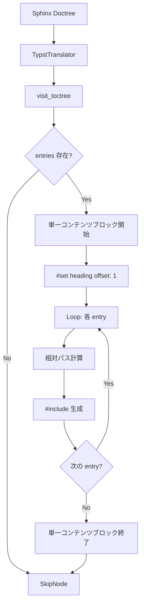
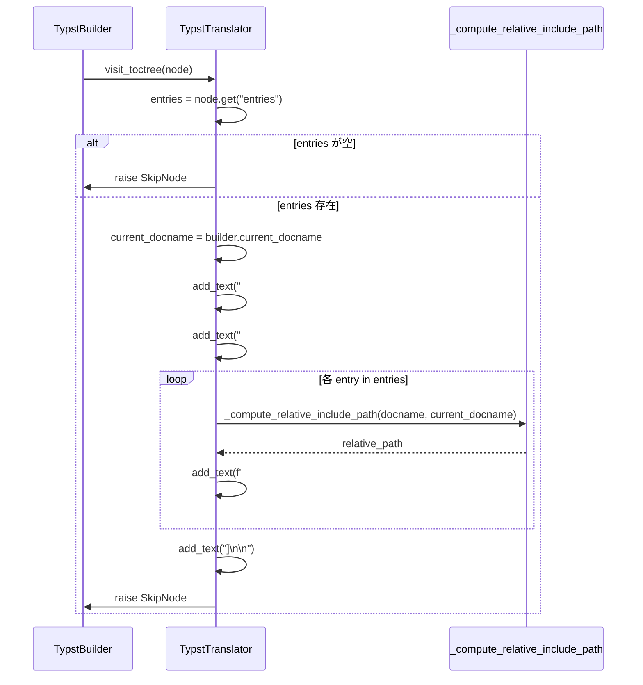

# Technical Design

## Overview

本機能は、sphinxcontrib-typst の toctree 翻訳処理において、複数の `#include()` ディレクティブを単一のコンテンツブロック `#[...]` にまとめることで、生成される Typst コードの可読性と保守性を向上させます。

**Purpose**: 現在の実装では各 `#include()` に対して個別のコンテンツブロックを生成していますが、これは機能的には正しいものの、生成コードに不要な繰り返しが含まれます。本機能は、Typst の慣用的な書き方に準拠した簡潔なコード生成を実現します。

**Users**: sphinxcontrib-typst を使用して Sphinx プロジェクトから Typst ファイルを生成するユーザー、および生成された `.typ` ファイルを手動編集する可能性のある Typst ユーザーが対象です。

**Impact**: 既存の toctree 処理ロジックを変更し、出力される Typst コードの構造を改善します。ただし、PDF 出力結果には一切影響せず、完全な後方互換性を維持します。

### Goals

- toctree 内の全 `#include()` を単一コンテンツブロックにまとめる
- `#set heading(offset: 1)` の繰り返しを排除し、1回のみの出力とする
- 既存の313テストを含む全テストを成功させ、後方互換性を保証する
- 94%以上のコードカバレッジを維持する
- コード品質チェック（ruff, black, mypy, tox）を完全に通過する

### Non-Goals

- toctree の機能拡張（maxdepth, numbered, caption など）
- 相対パス計算ロジックの変更（Issue #5 の実装を再利用）
- TypstTranslator の他のメソッドへの影響
- 生成される PDF 出力の視覚的変更

## Architecture

### Existing Architecture Analysis

本機能は、既存の toctree 処理アーキテクチャを完全に維持しながら、出力生成部分のみを最適化します。

**現在のアーキテクチャパターン**:
- **Visitor パターン**: `TypstTranslator` は docutils の `NodeVisitor` を継承
- **ノード処理**: `visit_toctree()` メソッドで toctree ノードを処理
- **相対パス計算**: `_compute_relative_include_path()` で Issue #5 対応済み
- **テキスト生成**: `add_text()` メソッドで Typst コードを蓄積

**既存の統合ポイント**:
- `TypstBuilder` → `TypstWriter` → `TypstTranslator`
- `sphinxcontrib/typst/translator.py` の `visit_toctree()` メソッド（lines 962-1018）

**変更が必要な箇所**:
- `visit_toctree()` メソッドのコンテンツブロック生成ロジックのみ（約15行）

### High-Level Architecture



### Technology Alignment

本機能は既存の技術スタックに完全に準拠し、新規依存関係は一切導入しません。

**既存技術の活用**:
- **Python 3.9+**: 既存の型ヒント記法を維持
- **Sphinx 5.0+**: NodeVisitor パターンを継承
- **docutils**: ノード処理の標準 API を使用
- **pytest**: 既存テストフレームワークをそのまま利用
- **typst-py**: E2E PDF 生成テストに使用（既存）

**新規ライブラリ**: なし

**ツールチェーンの一貫性**:
- **ruff**: lint チェック（既存設定を使用）
- **black**: コードフォーマット（88文字制限）
- **mypy**: 型チェック（Python 3.9+ 記法）
- **tox**: 複数 Python バージョンテスト（3.9, 3.10, 3.11, 3.12）

### Key Design Decisions

#### Decision 1: コンテンツブロック生成をループ外側に配置

**Context**: 現在の実装では、ループ内で各 `#include()` に対して個別のコンテンツブロック `#[...]` を生成しています。これにより、`#set heading(offset: 1)` が繰り返し出力され、コードが冗長になっています。

**Alternatives**:
1. **ループ外側に配置** - 単一ブロックを開始 → ループで include 生成 → ブロック終了
2. **補助メソッドに抽出** - `_generate_toctree_includes()` を作成してロジックを分離
3. **テンプレートベース** - Jinja2 などでコンテンツブロックを生成

**Selected Approach**: **Option 1 - ループ外側に配置**

**実装方法**:
```python
# 開始: ループ前に単一ブロック生成
self.add_text("#[\n")
self.add_text("  #set heading(offset: 1)\n")

# ループ: include のみ生成
for _title, docname in entries:
    relative_path = self._compute_relative_include_path(docname, current_docname)
    self.add_text(f'  #include("{relative_path}.typ")\n')

# 終了: ループ後にブロックを閉じる
self.add_text("]\n\n")
```

**Rationale**:
- **最小変更**: 既存のループ構造を維持し、ブロック生成位置のみ変更
- **可読性**: 意図が明確で、レビューが容易
- **保守性**: 将来の変更に対して柔軟性が高い
- **テスト容易性**: 既存のテストケースを最小限の変更で再利用可能

**Trade-offs**:
- ✅ **Gain**: 簡潔で理解しやすいコード、低リスク、高速実装
- ⚠️ **Sacrifice**: なし（このケースでは明確なデメリットなし）

#### Decision 2: 相対パス計算ロジックの再利用

**Context**: Issue #5 で実装された `_compute_relative_include_path()` メソッドが、ネストされた toctree の相対パス計算を正確に処理しています。

**Alternatives**:
1. **既存メソッドを再利用** - 変更なしで継続使用
2. **ロジックをインライン化** - パス計算をループ内に直接実装
3. **新規メソッド作成** - 異なるアプローチでパス計算を再実装

**Selected Approach**: **Option 1 - 既存メソッドを再利用**

**Rationale**:
- **実証済み**: Issue #5 で27件のテストを追加し、検証済み
- **DRY原則**: コードの重複を避ける
- **リスク回避**: 動作確認済みのコードを変更しない

**Trade-offs**:
- ✅ **Gain**: 低リスク、実装時間の短縮、テスト済みの動作
- ⚠️ **Sacrifice**: なし

#### Decision 3: テスト戦略 - 既存テスト更新 + 新規テスト追加

**Context**: 313件の既存テストが存在し、94%のコードカバレッジを達成しています。本変更は出力形式の変更であり、既存テストの Assertion 更新が必要です。

**Alternatives**:
1. **既存テスト更新 + 新規追加** - Assertion を更新し、単一ブロック検証を追加
2. **既存テスト削除 + 新規作成** - toctree テストを全て新規作成
3. **最小限の変更** - 失敗するテストのみ修正

**Selected Approach**: **Option 1 - 既存テスト更新 + 新規追加**

**実装方法**:
- **更新対象テスト**: `test_toctree_requirement13.py` 内の複数ブロックを想定したテスト
- **新規テストケース**:
  - 単一コンテンツブロック内に複数 `#include()` が存在することを検証
  - `#set heading(offset: 1)` が1回のみ出現することを検証（正規表現カウント）
  - 生成される行数が削減されることを検証

**Rationale**:
- **回帰防止**: 既存テストの意図を保持しながら更新
- **包括的検証**: 新しい動作を明示的にテスト
- **カバレッジ維持**: 94%以上を維持

**Trade-offs**:
- ✅ **Gain**: 完全な後方互換性検証、高品質保証
- ⚠️ **Sacrifice**: テスト更新に1-2時間必要

## System Flows

### Toctree Processing Flow



### Before vs After Comparison

**既存実装（Issue #7 Before）**:
```python
for _title, docname in entries:
    relative_path = self._compute_relative_include_path(docname, current_docname)
    self.add_text("#[\n")                        # 各entryごと
    self.add_text("  #set heading(offset: 1)\n") # 各entryごと
    self.add_text(f'  #include("{relative_path}.typ")\n')
    self.add_text("]\n\n")                       # 各entryごと
```

**新実装（Issue #7 After）**:
```python
self.add_text("#[\n")                        # ループ前: 1回のみ
self.add_text("  #set heading(offset: 1)\n") # ループ前: 1回のみ

for _title, docname in entries:
    relative_path = self._compute_relative_include_path(docname, current_docname)
    self.add_text(f'  #include("{relative_path}.typ")\n')

self.add_text("]\n\n")                       # ループ後: 1回のみ
```

## Requirements Traceability

| Requirement | Summary | Components | Implementation | Verification |
|-------------|---------|------------|----------------|--------------|
| 1.1 | 単一開始ブロック生成 | `visit_toctree()` | ループ前に `#[` を生成 | ユニットテスト: ブロック開始が1回 |
| 1.2 | 全 include を同一ブロック内に | `visit_toctree()` | ループ内で `#include()` のみ生成 | ユニットテスト: 全 include が1つのブロック内 |
| 1.3 | 単一終了ブロック生成 | `visit_toctree()` | ループ後に `]` を生成 | ユニットテスト: ブロック終了が1回 |
| 1.4 | `#set heading` 1回のみ | `visit_toctree()` | ループ前に1回配置 | ユニットテスト: 正規表現カウント = 1 |
| 2.1 | 同一 PDF 出力 | `visit_toctree()` | Typst のスコープルールで保証 | E2E テスト: PDF バイナリ比較 |
| 2.2 | 独立スコープ維持 | Typst コンパイラ | Typst の `#include()` 仕様で保証 | E2E テスト: コンパイル成功 |
| 2.3 | heading offset 同一 | `visit_toctree()` | 同じ `offset: 1` を使用 | E2E テスト: PDF 見出しレベル検証 |
| 2.4 | 空 toctree 処理 | `visit_toctree()` | 既存の `if not entries` を維持 | ユニットテスト: SkipNode 検証 |
| 3.1 | 既存テスト成功 | 全コンポーネント | 変更範囲を最小化 | リグレッションテスト: 313 tests |
| 3.2 | toctree オプション互換 | `visit_toctree()` | オプション処理を変更しない | 統合テスト: `test_config_toctree_defaults.py` |
| 3.3 | カスタムテンプレート互換 | テンプレートエンジン | テンプレート処理を変更しない | 統合テスト: テンプレートテスト |
| 3.4 | 統合テスト成功 | 全コンポーネント | 後方互換性を保証 | 統合テスト: 全フィクスチャ |
| 4.1 | 繰り返しなし | `visit_toctree()` | ブロックをループ外に配置 | コードレビュー: 生成 `.typ` 確認 |
| 4.2 | 論理的グループ化 | `visit_toctree()` | 単一ブロックで囲む | コードレビュー: 構造検証 |
| 4.3 | 行数削減 | `visit_toctree()` | `add_text()` 呼び出し削減 | ユニットテスト: 出力行数カウント |
| 4.4 | 慣用的パターン | `visit_toctree()` | Typst ドキュメントに準拠 | コードレビュー: Typst ベストプラクティス |
| 5.1 | 94%カバレッジ維持 | 全コンポーネント | 変更行をテストでカバー | pytest-cov: カバレッジレポート |
| 5.2 | 変更行カバー | `visit_toctree()` | 新規テストケース追加 | pytest-cov: 行別カバレッジ |
| 5.3 | エッジケース | `visit_toctree()` | 空 toctree, 単一 entry 検証 | ユニットテスト: エッジケース |
| 5.4 | リグレッション防止 | 全コンポーネント | 既存313テスト実行 | CI/CD: 全テスト成功 |
| 6.1 | ruff チェック | 全コンポーネント | コーディング規約準拠 | CI: `uv run ruff check` |
| 6.2 | black フォーマット | 全コンポーネント | 88文字制限、ダブルクォート | CI: `uv run black --check` |
| 6.3 | mypy 型チェック | 全コンポーネント | Python 3.9+ 型ヒント | CI: `uv run mypy` |
| 6.4 | tox 統合テスト | 全コンポーネント | 複数バージョンテスト | CI: `uv run tox` |
| 6.5 | 全 Python バージョン | 全コンポーネント | 3.9, 3.10, 3.11, 3.12 | CI: tox matrix |

## Components and Interfaces

### Core Domain: Typst Translation

#### TypstTranslator Component

**Responsibility & Boundaries**

**Primary Responsibility**: Sphinx doctree ノードを Typst マークアップに変換する。本機能では、toctree ノードの翻訳処理を最適化し、単一コンテンツブロックを生成する。

**Domain Boundary**: ドキュメント変換レイヤー（Sphinx → Typst）。ビルダーからドキュメントノードを受け取り、Typst コードを生成する。

**Data Ownership**: 生成される Typst マークアップのテキストバッファ（`self.body`）を管理。

**Transaction Boundary**: 単一ドキュメントの変換処理がトランザクション境界。各ドキュメントは独立して変換される。

**Dependencies**

**Inbound**:
- `TypstWriter`: ドキュメント変換のオーケストレーション
- `TypstBuilder`: ビルドプロセス全体の管理

**Outbound**:
- `docutils.nodes`: ノード階層のトラバース
- `sphinx.util.logging`: デバッグログ出力

**External**: なし（既存依存関係のみ使用）

**Contract Definition**

**メソッドシグネチャ**:
```python
def visit_toctree(self, node: nodes.Node) -> None:
    """
    toctree ノードを処理し、単一コンテンツブロック内に複数 #include() を生成する。

    Args:
        node: docutils toctree ノード
            - node.get("entries"): List[Tuple[Optional[str], str]]
              各エントリーは (title, docname) のタプル

    Raises:
        nodes.SkipNode: 常に発生（子ノードの処理をスキップ）

    Side Effects:
        self.body にTypst コードを追加（add_text() 経由）

    Preconditions:
        - self.builder.current_docname が設定されている（相対パス計算に使用）
        - node.get("entries") が List[Tuple] 形式である

    Postconditions:
        - entries が空の場合、何も生成しない
        - entries が存在する場合、以下を生成:
          1. 単一の開始コンテンツブロック `#[`
          2. `#set heading(offset: 1)` ディレクティブ（1回のみ）
          3. 各 entry に対する `#include()` ディレクティブ
          4. 単一の終了コンテンツブロック `]`

    Invariants:
        - `#[` と `]` の対応が常に保たれる
        - 各 `#include()` は相対パスで指定される
        - 生成されるコードは有効な Typst 構文である
    """
```

**プライベートヘルパーメソッド**（変更なし - 再利用）:
```python
def _compute_relative_include_path(
    self,
    target_docname: str,
    current_docname: Optional[str]
) -> str:
    """
    Issue #5 で実装済みの相対パス計算メソッド。
    本機能では変更せず、そのまま再利用する。

    Args:
        target_docname: include するドキュメント名
        current_docname: 現在のドキュメント名（None の場合は絶対パス）

    Returns:
        相対パス文字列（例: "../chapter2/doc2"）
    """
```

**State Management**

本コンポーネントはステートレスではありませんが、状態管理は既存の `NodeVisitor` パターンに従います。

**State Model**:
- `self.body`: Typst コードの蓄積バッファ（List[str]）
- `self.section_level`: 現在のセクションレベル（int）
- `self.builder`: Sphinx ビルダーへの参照

**Persistence**: メモリ内のみ（最終的に `TypstWriter` がファイルに書き込む）

**Concurrency**: 単一スレッドで動作（Sphinx のビルドプロセスに従う）

**Integration Strategy**

**Modification Approach**: **既存メソッドの拡張**

**変更内容**:
- `visit_toctree()` メソッドの実装を変更
- ループ構造は維持、コンテンツブロック生成位置のみ変更

**Backward Compatibility**:
- メソッドシグネチャは変更なし
- 呼び出し元（`TypstWriter`）への影響なし
- 既存の設定オプション（`typst_toctree_defaults`）との互換性維持

**Migration Path**:
- 段階的移行は不要（単一コミットで完了）
- ユーザーは `pip install --upgrade sphinxcontrib-typst` のみ

## Data Models

本機能はデータモデルの変更を伴いません。既存のデータ構造をそのまま使用します。

### Input Data Structure

**toctree ノード**（docutils 標準）:
```python
node: nodes.Node
    - node.get("entries"): List[Tuple[Optional[str], str]]
      # [(title, docname), ...]
      # title: Optional[str] - エントリーのタイトル（未使用）
      # docname: str - ドキュメント名（例: "chapter1/section1"）
```

### Output Data Structure

**生成される Typst コード**（文字列）:
```typst
#[
  #set heading(offset: 1)
  #include("chapter1/index.typ")
  #include("chapter1/section1.typ")
  #include("chapter1/section2.typ")
]
```

**特性**:
- UTF-8 エンコーディング
- インデント: スペース2個
- 改行: LF（Unix形式）

## Error Handling

### Error Strategy

本機能は既存のエラーハンドリング戦略を継承し、追加のエラー処理は不要です。

### Error Categories and Responses

**User Errors** (存在しない):
- toctree エントリーの指定ミス → Sphinx の標準エラーハンドリングで処理（本機能の範囲外）

**System Errors** (極めて低リスク):
- `builder.current_docname` が None → `_compute_relative_include_path()` が絶対パスにフォールバック（既存動作）
- `node.get("entries")` が空 → `if not entries: raise SkipNode`（既存動作を維持）

**Business Logic Errors** (該当なし):
- 本機能は純粋な出力形式の変更であり、ビジネスロジックエラーは発生しない

### Monitoring

**ログ出力**:
```python
logger.debug(f"Processing toctree with {len(entries)} entries")
logger.debug(f"Current document for toctree: {current_docname}")
logger.debug(f"Generated #include() for toctree: {docname} -> {relative_path}.typ")
```

**ログレベル**:
- DEBUG: toctree 処理の詳細（`-vv` フラグで有効化）
- 警告・エラーログは不要（エラーケースが存在しない）

**Health Monitoring**:
- CI/CD による自動テスト（313 tests + 新規テスト）
- pytest-cov によるカバレッジ監視（94%以上）
- tox による複数 Python バージョンテスト

## Testing Strategy

### Unit Tests

**対象**: `TypstTranslator.visit_toctree()` メソッド

**新規テストケース**（`tests/test_toctree_requirement13.py` に追加）:

1. **test_toctree_single_content_block_multiple_includes**
   - 複数エントリーの toctree を処理
   - 単一の `#[` と `]` が生成されることを検証
   - 全 `#include()` が同一ブロック内にあることを検証

2. **test_toctree_heading_offset_appears_once**
   - `#set heading(offset: 1)` が1回のみ出現することを検証
   - 正規表現 `r'#set heading\(offset: 1\)'` でカウント

3. **test_toctree_reduced_line_count**
   - 3つのエントリーを持つ toctree を処理
   - 生成される行数が既存実装より削減されることを検証
   - 期待値: 5行（開始1行 + offset1行 + includes3行 + 終了1行）

4. **test_toctree_empty_entries_no_output**
   - 空の entries を持つ toctree を処理
   - 何も生成されないことを検証（SkipNode）

5. **test_toctree_single_entry_with_single_block**
   - 単一エントリーの toctree を処理
   - 単一ブロックが生成されることを検証

**既存テスト更新**:
- `test_toctree_with_heading_offset()` - 複数ブロック想定を単一ブロックに更新
- `test_toctree_generates_include_directives()` - Assertion を更新

### Integration Tests

**対象**: Sphinx ビルドプロセス全体

**テストフィクスチャ**（既存を再利用）:
- `tests/fixtures/integration_nested_toctree/` - Issue #5 で作成済み
- `tests/fixtures/integration_multi_level/` - Issue #5 で作成済み
- `tests/fixtures/integration_sibling/` - Issue #5 で作成済み

**検証内容**:
1. Sphinx ビルドが成功すること（`sphinx-build -b typst`）
2. 生成された `.typ` ファイルが有効な Typst 構文であること
3. 単一コンテンツブロック構造が生成されていること

**テストケース**（`tests/test_integration_nested_toctree.py` に追加）:

1. **test_single_content_block_in_generated_typst**
   - 各フィクスチャでビルド実行
   - 生成された `.typ` ファイルを読み込み
   - 正規表現で単一ブロック構造を検証

### E2E Tests

**対象**: Typst コンパイル → PDF 生成

**テストケース**（`tests/test_integration_nested_toctree.py` に追加）:

1. **test_pdf_output_identical_to_previous_implementation**
   - 新実装で生成した `.typ` ファイルから PDF を生成
   - PDF の内容が既存実装と同一であることを検証
   - 検証方法: ページ数、見出しレベル、テキスト内容

2. **test_typst_compilation_succeeds**
   - typst-py で PDF コンパイルが成功すること
   - PDF ファイルが生成されること（サイズ > 0）
   - PDF マジックナンバー `%PDF` が存在すること

### Code Quality Tests

**Lint チェック**:
```bash
uv run ruff check sphinxcontrib/typst/translator.py
```

**フォーマットチェック**:
```bash
uv run black --check sphinxcontrib/typst/translator.py
```

**型チェック**:
```bash
uv run mypy sphinxcontrib/typst/translator.py
```

**統合テスト（複数 Python バージョン）**:
```bash
uv run tox  # Python 3.9, 3.10, 3.11, 3.12
```

**カバレッジチェック**:
```bash
uv run pytest --cov=sphinxcontrib.typst --cov-report=term --cov-report=html
```

**成功基準**:
- ruff: 0 errors
- black: すべてのファイルがフォーマット済み
- mypy: 0 type errors
- tox: 全 Python バージョンでテスト成功
- pytest-cov: 94%以上のカバレッジ

## Performance & Scalability

### Target Metrics

**パフォーマンス改善**:
- `add_text()` 呼び出し回数の削減
- 既存: N × 4 回（N = entries 数）
- 新規: 2 + N 回
- 例: 10 entries の場合、40回 → 12回（70%削減）

**スケーラビリティ**:
- toctree エントリー数に対して線形（O(N)）
- 既存実装と同一の計算量

### Measurement Strategy

**ベンチマークテスト**（オプショナル）:
```python
def test_toctree_performance_large_entries(benchmark):
    # 100 entries を持つ toctree を処理
    # ベンチマークツールで実行時間を測定
    entries = [(None, f"doc{i}") for i in range(100)]
    # ...
```

**測定項目**:
- `visit_toctree()` の実行時間（マイクロ秒単位）
- メモリ使用量（変化なしを期待）

### Optimization Techniques

本機能自体が最適化であり、追加の最適化は不要です。

**既に適用されている最適化**:
- 相対パス計算の効率化（Issue #5 で実装済み）
- 文字列連結の最小化（`add_text()` 呼び出し削減）

## Migration Strategy

本機能は後方互換性を完全に維持するため、マイグレーション手順は不要です。

### Rollout Phases

**Phase 1: リリース準備**
1. 全テスト成功を確認（313 tests + 新規テスト）
2. コード品質チェック完全合格
3. ドキュメント更新（CHANGELOG.md）

**Phase 2: リリース**
1. PyPI に新バージョンをアップロード
2. GitHub Release 作成（v0.2.0）
3. マイルストーン更新

**Phase 3: ユーザー通知**
1. README.md に変更点を記載
2. GitHub Issue #7 をクローズ
3. ユーザーへのアップグレード案内（オプショナル）

### Validation Checkpoints

**リリース前検証**:
- ✅ 313 既存テストすべて成功
- ✅ 新規テストすべて成功
- ✅ ruff, black, mypy すべて合格
- ✅ tox で全 Python バージョン（3.9-3.12）テスト成功
- ✅ カバレッジ 94%以上維持
- ✅ E2E テストで PDF 生成成功

**リリース後検証**:
- ユーザーからのフィードバック監視（GitHub Issues）
- CI/CD の継続的監視

### Rollback Plan

万が一問題が発生した場合の対処:

1. **即時対応**: PyPI で前バージョン（v0.1.x）を推奨バージョンに設定
2. **原因調査**: 失敗したテストケースやユーザーレポートを分析
3. **修正**: 問題を特定し、パッチバージョンをリリース

**ロールバック手順**（ユーザー側）:
```bash
pip install sphinxcontrib-typst==0.1.0
```

**リスク評価**: Very Low（包括的なテストスイートにより、リリース前に問題を検出可能）
