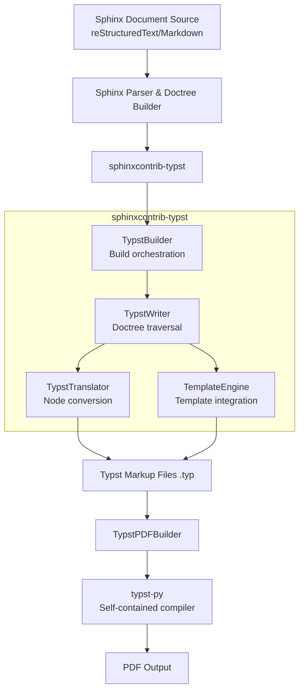
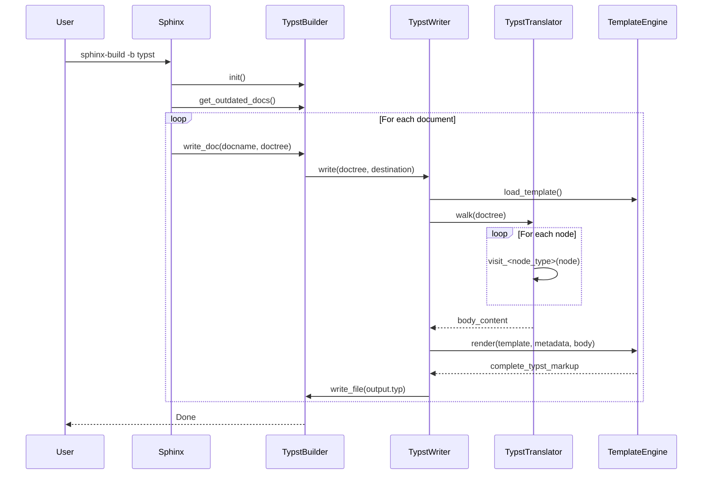
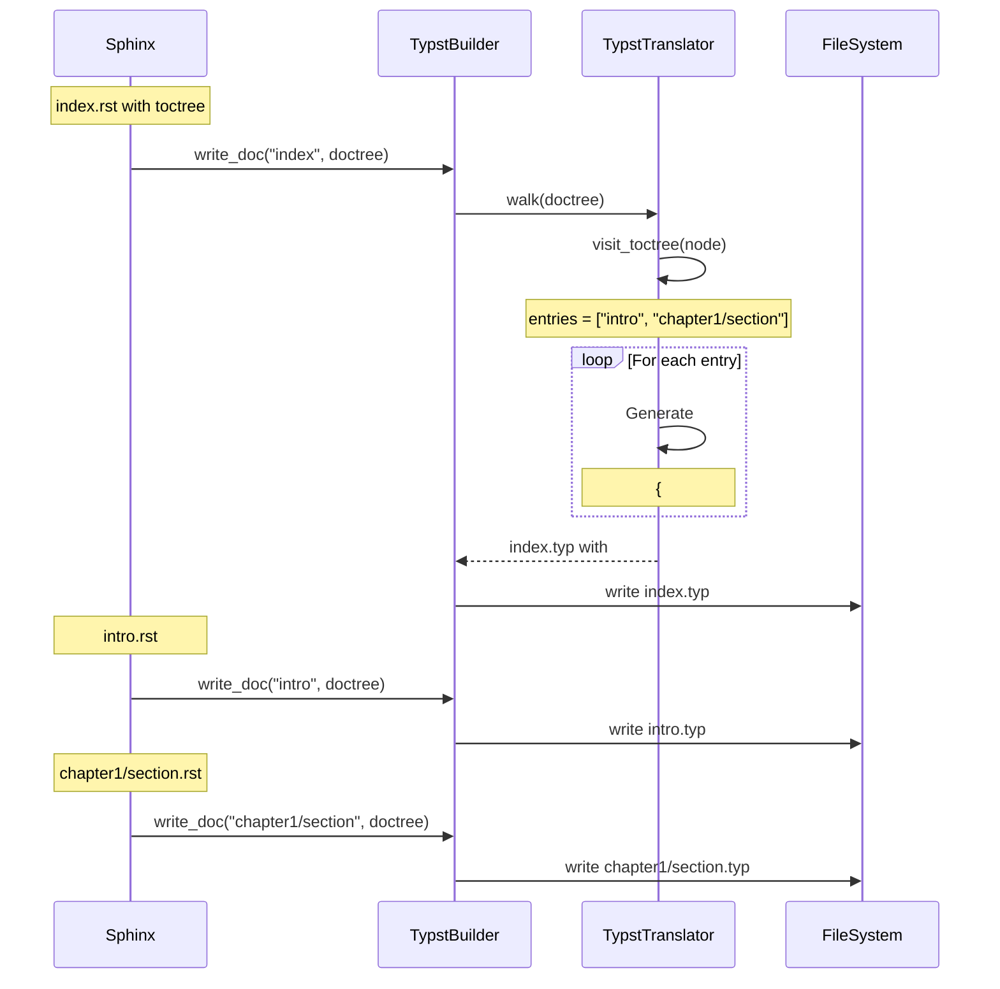
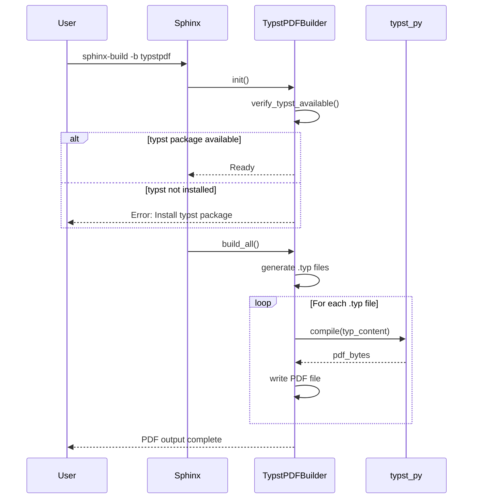

# Technical Design Document

## 1. Overview

### 1.1 Document Purpose
本ドキュメントはsphinxcontrib-typstの技術設計を定義する。requirements.mdで定義された13の要件を実現するためのアーキテクチャ、コンポーネント設計、データフロー、技術スタック、実装方針を詳述する。

### 1.2 Project Summary
sphinxcontrib-typstはSphinxドキュメントジェネレータにTypst組版システムのビルダー機能を追加する拡張パッケージである。Sphinxのdoctreeを Typstマークアップに変換し、自己完結型PDF生成機能を提供する。

### 1.3 Goals
1. **Sphinx標準ビルダーとしての統合**: 既存のSphinxワークフローにシームレスに統合
2. **高品質なTypstマークアップ生成**: doctreeの忠実な変換とTypst記法の最適活用
3. **自己完結型PDF生成**: 外部ツール不要で`pip install`だけで完結
4. **拡張性の確保**: カスタムノード、テンプレート、プラグインへの対応
5. **保守性と可読性**: モジュール化されたアーキテクチャと明確な責任分離

### 1.4 Non-Goals
- Typstの完全な機能セットのサポート（Sphinxが生成するdoctreeの範囲に限定）
- リアルタイムプレビュー機能（将来的な拡張として検討）
- Typst以外の組版システムへの対応

## 2. System Architecture

### 2.1 High-Level Architecture



### 2.2 Technology Alignment

**既存パターンの保持**:
- Sphinxの標準Builder/Writer/Translatorパターンを継承
- docutilsのNodeVisitorパターンでノード変換
- Pythonの型ヒント活用（Python 3.9+）

**新規コンポーネントの根拠**:
- **TemplateEngine**: Typstテンプレートの柔軟な管理とパラメータマッピング
- **NodeHandlerRegistry**: カスタムノードの拡張可能性
- **TypstPDFBuilder**: 自己完結型PDF生成

**技術スタック適合**:
- Python 3.9+: Sphinxの要件に合わせる
- Sphinx 5.0+: 最新のビルダーAPI活用
- typst-py: 自己完結型PDF生成を実現

**ステアリング準拠**:
- product.md: Sphinx+Typstの統合という価値提案を実現
- tech.md: Sphinx拡張パターンに準拠
- structure.md: 明確なディレクトリ構成とコード規約

## 3. Key Design Decisions

### 3.1 決定: 複数ドキュメント統合にTypstの`#include()`を活用

**Context**: Requirement 13で複数のreStructuredTextファイルを統合して単一のPDFを生成する必要がある。Sphinxの`toctree`ディレクティブをTypstでどう実現するかが課題。

**Alternatives**:
1. **アプローチA（Sphinxのdoctree統合に依存）**: Sphinxがtoctreeを解決し、参照先の内容をマスタードキュメントのdoctreeに統合。すべて1つの.typファイルに含まれる。
2. **アプローチB（Typstの#includeを活用）**: 各.rst→個別の.typファイルを生成。マスタードキュメントのtoctree→`#include("path.typ")`に変換。Typstのコンパイル時に統合。

**Selected Approach**: **アプローチB - Typstの`#include()`を活用**

```typst
// index.typ (マスタードキュメント)
= マインタイトル

== セクション1

// toctree による #include (見出しレベルを1下げる)
{
  #set heading(offset: 1)
  #include("intro.typ")
}

{
  #set heading(offset: 1)
  #include("chapter1.typ")
}
```

**Rationale**:
1. **モジュール性**: 各ドキュメントが独立した.typファイルとして管理される
2. **Typstネイティブ**: `#include()`でファイル統合、Typstの機能を最大限活用
3. **見出しレベル制御**: `#set heading(offset: 1)`でSphinxのtoctree動作を再現
4. **デバッグ容易性**: 個別ファイルのTypst構文エラーを特定しやすい

**Trade-offs**:
- **Gain**: ファイル分割、明確なモジュール境界、Typstの標準機能活用
- **Sacrifice**: toctreeノード処理で相対パス解決の実装が必要

### 3.2 決定: `#outline()`はテンプレートで管理

**Context**: PDFとして考えたとき、ドキュメント途中で目次が登場することは基本的にない。起点ファイルだけに`#outline()`を含めるべき。

**Alternatives**:
1. 各`toctree`ノードで`#outline()`を生成
2. マスタードキュメントの冒頭に1つだけ`#outline()`を挿入
3. テンプレートで`#outline()`を管理し、ドキュメント本文には含めない

**Selected Approach**: **テンプレートで`#outline()`を管理**

```typst
// base.typ
#let project(
  title: "",
  authors: (),
  toctree_maxdepth: 2,
  toctree_numbered: false,
  body
) = {
  set document(title: title, author: authors)
  set page(numbering: "1", number-align: center)

  // Title page
  align(center)[
    #text(2em, weight: "bold")[#title]
  ]

  pagebreak()

  // Table of Contents
  outline(depth: toctree_maxdepth, indent: true)

  pagebreak()

  // Body
  body
}
```

**Rationale**:
1. **関心の分離**: 目次の生成はテンプレートの責務、本文とは独立
2. **カスタマイズ容易**: ユーザーがテンプレートを変更するだけで目次スタイルを調整可能
3. **Sphinx動作との整合**: Sphinxのtoctreeも最終的にドキュメント全体の目次を生成

**Trade-offs**:
- **Gain**: テンプレートレベルでの柔軟なカスタマイズ、本文とのクリーンな分離
- **Sacrifice**: toctreeオプション（`:maxdepth:`, `:numbered:`）をテンプレートパラメータとして渡す必要

### 3.3 決定: mitexによるLaTeX数式サポート（Requirement 4）

**Context**: Sphinxの数式ノード（LaTeX形式）をTypstで表示する必要がある。手動変換は複雑でエラーが多い。

**Alternatives**:
1. LaTeX→Typstの完全な手動変換実装
2. mitexパッケージ（`@preview/mitex`）を活用
3. Typstネイティブ数式のみサポート

**Selected Approach**: **mitexパッケージを活用、Typstネイティブ数式もサポート**

**Rationale**:
- mitexは32.5k数式で実証済み、高い互換性
- 185KBと軽量
- Typstネイティブ数式も並行サポート（`typst_use_mitex = False`でフォールバック）

### 3.4 決定: typst-pyによる自己完結型PDF生成（Requirement 9）

**Context**: 外部Typst CLIへの依存を最小化し、`pip install sphinxcontrib-typst`だけでPDF生成を完結させたい。

**調査結果**:
- **typst-py**: PyO3/Maturinを使用したRustバインディング
- **自己完結性**: Typstコンパイラ（Rust実装）がネイティブ拡張モジュールとしてwheelにバンドルされている
- **プラットフォーム対応**: Windows、Linux（複数アーキテクチャ）、macOS（x86-64/ARM64）向けのwheelを提供
- **ファイルサイズ**: 17.3MB〜22.6MB（プラットフォーム依存）
- **外部依存不要**: 外部Typst CLIのインストールは不要

**Selected Approach**: **typst-py（自己完結型Pythonバインディング）を依存関係に含める**

```python
dependencies = [
    "sphinx>=5.0",
    "docutils>=0.18",
    "typst>=0.13.0",  # PyPIパッケージ名は "typst"
]
```

**Rationale**:
1. **完全な自己完結性**: typst-pyはTypstコンパイラをバンドルしており、外部CLIは不要
2. **CI/CD環境での追加セットアップ不要**: `pip install`だけで完結
3. **プラットフォーム対応**: 主要なOS/アーキテクチャ向けのwheelが提供されている
4. **ユーザー体験の向上**: インストール手順が単純化される

**Trade-offs**:
- **Gain**: 外部依存ゼロ、インストールの簡素化、プラットフォーム間の一貫性
- **Sacrifice**: パッケージサイズが17-22MB増加（Typstバイナリを含むため）

**Fallback戦略（設計から削除）**:
- 当初計画していた「typst-py利用不可時の外部Typst CLIへのフォールバック」は不要
- typst-pyが自己完結型であるため、フォールバックメカニズムは実装しない
- インストール時にtypstパッケージが正常にインストールされることを前提とする

### 3.5 決定: codlyパッケージによる高度なコードハイライト（Requirement 7）

**Context**: Sphinxの`literal_block`ノードは行番号表示、特定行のハイライト、Pygmentsによるシンタックスハイライトなど高度な機能を持つ。Typstネイティブの`` ```言語名 ``記法は基本的だが、より高度な機能には対応していない。

**調査結果**:
- **Typstネイティブ`` ```言語名 ``**: 基本的なシンタックスハイライトのみ、行番号・ハイライト行なし
- **Typst `#raw()`関数**: `numbering`パラメータで行番号をサポート、`block: true`でブロック表示
- **codly (Typst Universe)**: 行番号、ハイライト行、カスタムアイコン、zebra striping、その他高度な機能を提供
  - GitHub: [Dherse/codly](https://github.com/Dherse/codly)
  - Features: Line numbering, line highlighting, custom languages, annotations, themes

**Selected Approach**: **codlyパッケージ（Typst Universe）をすべてのコードブロックに使用**

```typst
#import "@preview/codly:1.0.0": *
#show: codly-init.with()

// Configure codly (デフォルト設定)
#codly(
  languages: (
    python: (name: "Python", icon: "🐍", color: blue),
  ),
  number-format: it => text(fill: gray)[#it],
  zebra-fill: luma(250),
)

// 基本的なコードブロック（行番号が自動表示される）
```python
def hello():
    print("Hello")
\```

// ハイライト行付きコードブロック
#codly-range(highlight: (2, 4-6))
```python
def hello():
    print("Hello")  // Line 2 highlighted
    x = 1
    y = 2          // Lines 4-6 highlighted
    z = 3
    return x + y + z
\```
```

**Implementation Strategy**:
1. **すべてのコードブロック**: codlyパッケージを使用（行番号がデフォルトで表示）
2. **テンプレート統合**: codlyのimportと初期化をテンプレートに必ず含める
3. **ハイライト行**: `highlight_args`がある場合、`#codly-range()`を使用
4. **設定の簡素化**: 複雑な条件分岐なし、常にcodlyを使用

**Configuration in conf.py**:
```python
# codly設定（オプショナル、デフォルト値を使用可能）
typst_codly_config = {
    "zebra_fill": "luma(250)",
    "number_format": "it => text(fill: gray)[#it]",
    "enable_icons": True,
}
```

**Rationale**:
1. **一貫性**: すべてのコードブロックで統一された外観と機能
2. **シンプルな実装**: 条件分岐が不要で、常にcodlyを使用
3. **機能の完全性**: 行番号、ハイライト行、アイコンなどすべての機能が利用可能
4. **エコシステム活用**: Typst Universeの成熟したパッケージを全面的に利用
5. **保守性**: codlyはアクティブにメンテナンスされており、将来的な機能追加も期待できる

**Trade-offs**:
- **Gain**:
  - 実装の簡素化（条件分岐なし）
  - 一貫した外観
  - 行番号が常に利用可能
  - 将来の拡張性
- **Sacrifice**:
  - Typst Universeへの必須依存
  - 行番号を非表示にしたい場合でも表示される（設定で無効化可能）
- **Mitigation**: codlyは広く使用されており、Typst Universeで安定したパッケージ

**Alternative Considered**:
- **Option A**: `#raw()`のみ使用 → 行番号は可能だが、ハイライト行は不可
- **Option B**: 独自実装 → 開発コスト高、保守負担大
- **Option C**: 条件分岐でcodlyを使い分け → 実装が複雑化、一貫性が失われる
- **Option D**: codlyを常に使用 → **選択した方式**（最もシンプルで一貫性がある）

### 3.6 決定: gentle-cluesによるAdmonition表示（Requirement 2）

**Context**: Sphinxのadmonitionノード（note, warning, tip, important等）を視覚的に魅力的なTypst形式で表示する必要がある。

**Alternatives**:
1. Typstネイティブのブロック構文で独自実装
2. note-meパッケージ（`@preview/note-me`）を活用
3. gentle-cluesパッケージ（`@preview/gentle-clues`）を活用

**Selected Approach**: **gentle-cluesパッケージを活用**

**Rationale**:
1. **視覚的な美しさ**: mdbook-admonish風のモダンなデザイン
2. **豊富なclue types**: 12種類のプリセット（info, tip, warning, error, success, question, memo, task, idea, quote, example, abstract）
3. **カスタマイズ性**: タイトル、色、カウンターなど柔軟にカスタマイズ可能
4. **多言語対応**: linguifyパッケージによる自動言語検出
5. **エコシステム**: MIT License、活発なメンテナンス、Typst 0.13.0+対応

**Sphinx→Typst マッピング**:

| Sphinxノード | Typst gentle-clues | 理由 |
|-------------|-------------------|------|
| `<note>` | `#info[]` | 情報提供の目的が一致 |
| `<tip>` | `#tip[]` | 直接対応 |
| `<warning>` | `#warning[]` | 直接対応 |
| `<important>` | `#warning(title: "Important")[]` | 重要度が高い警告として |
| `<caution>` | `#warning[]` | 警告として統一 |
| `<seealso>` | `#info(title: "See Also")[]` | 追加情報として |

**実装例**:
```python
def visit_note(self, node: nodes.note) -> None:
    """noteノードをTypst gentle-clues info形式に変換"""
    self.add_text("#info[\n")

def depart_note(self, node: nodes.note) -> None:
    self.add_text("]\n\n")

def visit_warning(self, node: nodes.warning) -> None:
    """warningノードをTypst gentle-clues warning形式に変換"""
    self.add_text("#warning[\n")

def depart_warning(self, node: nodes.warning) -> None:
    self.add_text("]\n\n")

def visit_important(self, node: nodes.important) -> None:
    """importantノードをタイトル付きwarningとして変換"""
    self.add_text('#warning(title: "Important")[\n')

def depart_important(self, node: nodes.important) -> None:
    self.add_text("]\n\n")
```

**Trade-offs**:
- **Gain**:
  - 視覚的に魅力的なドキュメント
  - 実装の簡素化（プリセット活用）
  - 多言語サポートが自動
  - 将来的なカスタマイズの余地
- **Sacrifice**:
  - Typst Universeへの依存（gentle-clues@1.2.0）
  - カスタムスタイルの場合は追加設定が必要
- **Mitigation**: gentle-cluesは広く使用されており、安定したパッケージ

**Alternative Considered**:
- **Option A**: 独自実装 → デザインコスト高、保守負担大
- **Option B**: note-meパッケージ → GitHub風だがカスタマイズ性が低い
- **Option C**: gentle-cluesパッケージ → **選択した方式**（最も美しく柔軟性がある）

## 4. System Flows

### 4.1 Typst Markup Generation Flow



### 4.2 Multiple Document Integration Flow (Requirement 13)



### 4.3 PDF Generation Flow



## 5. Requirements Traceability

| Requirement | Components | Interfaces | Flows |
|-------------|-----------|------------|-------|
| 1. Sphinx ビルダー統合 | TypstBuilder | setup(), init(), write_doc() | Typst Markup Generation Flow |
| 2. Doctree→Typst変換 | TypstTranslator | visit_<node>(), depart_<node>() | Node conversion loop |
| 3. 相互参照とリンク | TypstTranslator | visit_pending_xref(), visit_reference() | - |
| 4. 数式サポート（mitex） | TypstTranslator | visit_math(), visit_math_block() | - |
| 5. Typstネイティブ数式 | TypstTranslator | visit_math(), visit_math_block() | - |
| 6. 図表の埋め込み | TypstTranslator | visit_figure(), visit_table() | - |
| 7. コードハイライト | TypstTranslator | visit_literal_block() | - |
| 8. テンプレートとカスタマイズ | TemplateEngine | load_template(), map_parameters(), render() | - |
| 9. 自己完結型PDF生成 | TypstPDFBuilder | _compile_with_py(), _compile_with_cli() | PDF Generation Flow |
| 10. エラーハンドリング | ErrorHandler | logger.warning(), logger.error() | - |
| 11. 拡張性とプラグイン対応 | NodeHandlerRegistry | register(), get_handler() | - |
| 12. テストとドキュメント | Test Suite | pytest, sphinx-testing | - |
| 13. 複数ドキュメント統合 | TypstTranslator, TemplateEngine | visit_toctree(), render() | Multiple Document Integration Flow |

## 6. Components and Interfaces

### 6.1 TypstBuilder

**責任と境界**:
- **主要責務**: Sphinxビルダーとして登録され、ビルドプロセス全体をオーケストレーション
- **ドメイン境界**: Sphinxビルダーレイヤー
- **データ所有権**: ビルド設定、出力ファイルパス管理
- **トランザクション境界**: ドキュメント単位のビルド処理

**依存関係**:
- **Inbound**: Sphinxアプリケーション
- **Outbound**: TypstWriter, FileSystem
- **External**: なし

**契約定義**:

```python
class TypstBuilder(Builder):
    name = 'typst'
    format = 'typst'
    out_suffix = '.typ'

    def init(self) -> None:
        """ビルダー初期化、設定読み込み"""

    def get_outdated_docs(self) -> Iterator[str]:
        """更新が必要なドキュメントを特定"""

    def get_target_uri(self, docname: str, typ: str = None) -> str:
        """ドキュメント名からURIを生成"""

    def prepare_writing(self, docnames: Set[str]) -> None:
        """書き込み前の準備処理"""

    def write_doc(self, docname: str, doctree: nodes.document) -> None:
        """個別ドキュメントのTypst変換と書き込み"""

    def finish(self) -> None:
        """ビルド完了後の後処理"""
```

**Preconditions**:
- Sphinxの初期化が完了している
- conf.pyに必要な設定が定義されている

**Postconditions**:
- すべてのドキュメントが.typファイルとして出力されている
- エラーが発生した場合は適切にログ記録されている

### 6.2 TypstWriter

**責任と境界**:
- **主要責務**: Doctreeを受け取り、TypstTranslatorを使用してTypstマークアップを生成
- **ドメイン境界**: 変換オーケストレーションレイヤー
- **データ所有権**: 変換中の中間状態

**契約定義**:

```python
class TypstWriter(Writer):
    def __init__(self, builder: TypstBuilder):
        self.builder = builder
        self.translator_class = TypstTranslator

    def translate(self) -> None:
        """DoctreeをTypstに変換"""
        visitor = self.translator_class(self.document, self.builder)
        self.document.walkabout(visitor)
        self.output = visitor.astext()
```

### 6.3 TypstTranslator

**責任と境界**:
- **主要責務**: NodeVisitorパターンでdoctreeの各ノードをTypstマークアップに変換
- **ドメイン境界**: ノード変換レイヤー
- **データ所有権**: 変換中のTypstマークアップバッファ

**対応ノードカテゴリ**（70+標準ノード + 14+Sphinxノード）:

| カテゴリ | ノード数 | 主要ノード例 |
|---------|---------|------------|
| Document Structure | 8 | `document`, `section`, `title` |
| Body Elements | 8 | `paragraph`, `literal_block`, `block_quote` |
| Lists | 8 | `bullet_list`, `enumerated_list`, `definition_list` |
| Tables | 7 | `table`, `tgroup`, `thead`, `tbody`, `row`, `entry` |
| Inline Elements | 9 | `emphasis`, `strong`, `literal`, `subscript` |
| References | 8 | `reference`, `target`, `footnote`, `citation` |
| Images/Figures | 4 | `image`, `figure`, `caption` |
| Math | 2 | `math`, `math_block` |
| Special | 6 | `raw`, `comment`, `problematic` |
| Admonitions | 10 | `note`, `warning`, `danger`, `tip` |
| Sphinx addnodes | 14+ | `pending_xref`, `desc`, `toctree` |

**重要な実装 - visit_toctree (Requirement 13)**:

```python
def visit_toctree(self, node: addnodes.toctree) -> None:
    """
    Toctreeノードを処理し、#includeディレクティブを生成

    Requirement 13: 複数ドキュメントの統合と toctree 処理
    - 各エントリーに対して#include()を生成
    - 見出しレベルを1下げるため#set heading(offset: 1)を適用
    """
    entries = node.get('entries', [])

    for title, docname in entries:
        # 相対パス解決
        relative_path = self._resolve_relative_path(docname)

        # 見出しレベル調整付き#includeを生成
        self.body.append('{\n')
        self.body.append('  #set heading(offset: 1)\n')
        self.body.append(f'  #include("{relative_path}.typ")\n')
        self.body.append('}\n\n')

    raise nodes.SkipNode

def _resolve_relative_path(self, docname: str) -> str:
    """ビルド出力ディレクトリを基準とした相対パスを解決"""
    # current_docnameとdocnameから相対パスを計算
    # 例: "intro" → "intro"
    # 例: "chapter1/section" → "chapter1/section"
    return docname
```

**Fallback戦略**:

```python
def unknown_visit(self, node: nodes.Node) -> None:
    """未知のノードに対するフォールバック処理"""
    # 1. カスタムハンドラー確認
    handler = NodeHandlerRegistry.get_handler(type(node))
    if handler:
        handler(self, node)
        return

    # 2. 警告ログ
    logger.warning(
        f'Unknown node type: {node.__class__.__name__}',
        location=node
    )

    # 3. テキストコンテンツ抽出
    if hasattr(node, 'astext'):
        self.body.append(node.astext())
```

### 6.4 TemplateEngine (Requirement 8, Requirement 13)

**責任と境界**:
- **主要責務**: Typstテンプレートの読み込み、メタデータマッピング、`#outline()`パラメータ管理
- **ドメイン境界**: テンプレート処理レイヤー

**契約定義**:

```python
class TemplateEngine:
    def __init__(self, builder: TypstBuilder):
        self.builder = builder
        self.config = builder.config

    def load_template(self, template_name: str) -> str:
        """テンプレートファイルを読み込み"""

    def map_parameters(self, metadata: Dict[str, Any]) -> Dict[str, Any]:
        """Sphinxメタデータをテンプレートパラメータにマッピング"""

    def extract_toctree_options(self, doctree: nodes.document) -> Dict[str, Any]:
        """
        doctreeからtoctreeオプションを抽出

        Requirement 13: toctreeオプションをテンプレートパラメータとして抽出
        - maxdepth: 目次の深さ
        - numbered: 番号付き目次
        - caption: 目次のキャプション
        """
        toctree_node = doctree.traverse(addnodes.toctree)
        if not toctree_node:
            return {}

        node = toctree_node[0]
        return {
            'toctree_maxdepth': node.get('maxdepth', 2),
            'toctree_numbered': node.get('numbered', False),
            'toctree_caption': node.get('caption', ''),
        }

    def render(self, template: str, metadata: Dict[str, Any], body: str) -> str:
        """テンプレートにメタデータと本文を埋め込んで完全なTypstドキュメントを生成"""
```

**テンプレート構造例（Requirement 13対応）**:

```typst
// base.typ
#let project(
  title: "",
  authors: (),
  date: none,
  toctree_maxdepth: 2,
  toctree_numbered: false,
  toctree_caption: "Contents",
  body
) = {
  set document(title: title, author: authors)
  set page(numbering: "1", number-align: center)

  // Title page
  align(center)[
    #text(2em, weight: "bold")[#title]
    #v(1em)
    #text(1.2em)[#authors.join(", ")]
    #v(0.5em)
    #date
  ]

  pagebreak()

  // Table of Contents (Requirement 13: #outline()はテンプレートで管理)
  if toctree_caption != "" [
    #heading(outlined: false)[#toctree_caption]
  ]
  #outline(
    depth: toctree_maxdepth,
    indent: true
  )

  pagebreak()

  // Body (includes #include directives from toctree)
  body
}

// Sphinxから生成された内容
#show: project.with(
  title: "{{project}}",
  authors: ("{{author}}",),
  date: "{{release}}",
  toctree_maxdepth: {{toctree_maxdepth}},
  toctree_numbered: {{toctree_numbered}},
)

{{body}}
```

### 6.5 TypstPDFBuilder (Requirement 9)

**責任と境界**:
- **主要責務**: Typstマークアップから PDFを生成（typst-pyを使用）
- **ドメイン境界**: PDF生成レイヤー

**依存関係**:
- **External**: typst（PyPIパッケージ、自己完結型Typstコンパイラを含む）

**契約定義**:

```python
class TypstPDFBuilder(TypstBuilder):
    name = 'typstpdf'
    format = 'pdf'
    out_suffix = '.pdf'

    def __init__(self, app: Sphinx):
        super().__init__(app)
        self._verify_typst_available()

    def _verify_typst_available(self) -> None:
        """typstパッケージが利用可能か検証"""
        try:
            import typst
        except ImportError:
            raise ExtensionError(
                'typst package not found. Please install it:\n'
                '  pip install typst\n'
                'Or install sphinxcontrib-typst with PDF support:\n'
                '  pip install sphinxcontrib-typst[pdf]'
            )

    def write_doc(self, docname: str, doctree: nodes.document) -> None:
        """Typstマークアップを生成し、PDFにコンパイル"""
        # Generate .typ file
        super().write_doc(docname, doctree)

        # Compile to PDF
        typ_path = self.get_outfilename(docname)
        pdf_path = typ_path.replace('.typ', '.pdf')

        self._compile_to_pdf(typ_path, pdf_path)

    def _compile_to_pdf(self, typ_path: str, pdf_path: str) -> None:
        """typst-pyでPDF生成"""
        import typst

        try:
            with open(typ_path, 'r', encoding='utf-8') as f:
                typ_content = f.read()

            # Typstコンパイル実行
            pdf_bytes = typst.compile(typ_content)

            with open(pdf_path, 'wb') as f:
                f.write(pdf_bytes)

            logger.info(f'PDF generated: {pdf_path}')

        except Exception as e:
            logger.error(
                f'Failed to compile {typ_path} to PDF: {e}',
                location=typ_path
            )
            raise
```

**設計の簡素化**:
- **Fallback不要**: typst-pyが自己完結型のため、外部CLIへのフォールバックメカニズムを削除
- **エラーハンドリング**: typstパッケージが未インストールの場合は明確なエラーメッセージを表示
- **オプショナル依存**: pyproject.tomlで`[pdf]` extraとして定義可能（`pip install sphinxcontrib-typst[pdf]`）

### 6.6 NodeHandlerRegistry (Requirement 11)

**責任と境界**:
- **主要責務**: カスタムノードハンドラーの登録と検索
- **ドメイン境界**: 拡張性レイヤー

**契約定義**:

```python
class NodeHandlerRegistry:
    _handlers: Dict[Type[nodes.Node], Callable] = {}

    @classmethod
    def register(cls, node_type: Type[nodes.Node], handler: Callable) -> None:
        """カスタムノードハンドラーを登録"""
        cls._handlers[node_type] = handler

    @classmethod
    def get_handler(cls, node_type: Type[nodes.Node]) -> Optional[Callable]:
        """ノードタイプに対応するハンドラーを取得"""
        return cls._handlers.get(node_type)
```

**使用例**:

```python
# ユーザーがconf.pyで登録
from sphinxcontrib.typst import NodeHandlerRegistry
from myextension import MermaidNode, handle_mermaid_node

def setup(app):
    NodeHandlerRegistry.register(MermaidNode, handle_mermaid_node)
```

## 7. Error Handling

### 7.1 エラー分類と対応

| エラータイプ | 処理方針 | 実装 |
|------------|---------|------|
| 変換不可ノード | 警告を出力、テキストコンテンツを抽出 | `unknown_visit()` |
| テンプレート不明 | デフォルトテンプレートにフォールバック | `load_template()` |
| 画像ファイル不明 | プレースホルダー出力、警告 | `visit_image()` |
| Typstコンパイルエラー | エラーメッセージを表示、ビルド中断 | `_compile_to_pdf()` |
| mitex非対応構文 | 警告、Typstネイティブ数式への変換試行 | `visit_math_block()` |
| typstパッケージ未インストール | 明確なエラーメッセージ表示、ビルド中断 | `_verify_typst_available()` |
| toctree参照先不明 | 警告、#includeをコメントアウト | `visit_toctree()` |

### 7.2 ロギング戦略

```python
from sphinx.util import logging

logger = logging.getLogger(__name__)

# Warning level
logger.warning('Unknown node type: %s', node.__class__.__name__,
               location=node)

# Error level
logger.error('Template not found: %s', template_path)

# Debug level (SPHINX_TYPST_DEBUG=1)
logger.debug('Converting node: %s', node)
```

### 7.3 ユーザーフレンドリーなエラーメッセージ

```python
if not self.typst_compiler:
    raise ExtensionError(
        'No Typst compiler found. Please install typst-py:\n'
        '  pip install typst-py\n'
        'Or install Typst CLI:\n'
        '  https://github.com/typst/typst#installation'
    )

if not os.path.exists(typ_file):
    logger.warning(
        'Referenced document not found: %s. '
        'Skipping #include directive.',
        docname,
        location=toctree_node
    )
```

## 8. Testing Strategy

### 8.1 ユニットテスト

**対象**: 個別コンポーネントの機能

**ツール**: pytest, uv

**テストケース例**:

```python
# tests/test_translator.py
def test_section_conversion():
    """Sectionノードが正しくTypst見出しに変換されるか"""

def test_math_block_with_mitex():
    """数式ブロックがmitex形式で出力されるか"""

def test_figure_with_label():
    """Figureノードがラベル付きで変換されるか"""

def test_toctree_with_includes():
    """
    Requirement 13: toctreeノードが#includeディレクティブを生成するか
    見出しレベル調整（offset: 1）が適用されるか
    """

# tests/test_template_engine.py
def test_parameter_mapping():
    """パラメータマッピングが正しく適用されるか"""

def test_toctree_options_extraction():
    """
    Requirement 13: toctreeオプションが正しく抽出されるか
    maxdepth, numbered, captionがテンプレートパラメータとして渡されるか
    """
```

### 8.2 統合テスト

**対象**: ビルドプロセス全体

**ツール**: pytest + sphinx-testing, uv

**テストケース例**:

```python
# tests/test_integration.py
def test_build_simple_project(tmp_path):
    """シンプルなSphinxプロジェクトが正しくビルドされるか"""

def test_build_with_math(tmp_path):
    """数式を含むプロジェクトが正しく変換されるか"""

def test_build_with_custom_template(tmp_path):
    """カスタムテンプレートが正しく適用されるか"""

def test_build_multi_document_with_toctree(tmp_path):
    """
    Requirement 13: 複数ドキュメントのプロジェクトが正しくビルドされるか
    - マスタードキュメントに#includeディレクティブが生成される
    - 参照された各ドキュメントが独立した.typファイルとして出力される
    - 見出しレベルが正しく調整される
    """

def test_pdf_generation(tmp_path):
    """PDFビルダーが正しくPDFを生成するか"""
```

### 8.3 フィクスチャベーステスト

**構造**:

```
tests/fixtures/
├── sample_docs/
│   ├── conf.py
│   ├── index.rst           # toctree含む
│   ├── intro.rst           # toctreeで参照
│   ├── chapter1/
│   │   └── section.rst     # toctreeで参照
│   ├── math.rst
│   └── figures.rst
└── expected_output/
    ├── index.typ            # #includeディレクティブ含む
    ├── intro.typ
    ├── chapter1/
    │   └── section.typ
    ├── math.typ
    └── figures.typ
```

### 8.4 カバレッジ目標

- **ユニットテスト**: 80%以上
- **統合テスト**: 主要ワークフロー100%
- **CI/CD**: すべてのテストを自動実行（uv使用）

## 9. Configuration Reference

### 9.1 Sphinx conf.py設定項目

```python
# === Basic Configuration ===
# Note: sphinxcontrib-typst is auto-discovered via entry points.
# Adding to extensions list is optional but recommended for clarity.
# extensions = ['sphinxcontrib.typst']

# === Typst Builder Configuration ===
# ビルド対象ドキュメント
typst_documents = [
    ('index', 'output.typ', 'Project Documentation', 'Author Name'),
]

# === Template Configuration ===
# カスタムテンプレートパス
typst_template = '_templates/custom.typ'

# テンプレートパラメータマッピング
typst_template_params = {
    'title': 'project',
    'authors': ['author'],
    'date': 'release',
}

# テンプレートに渡す追加パラメータ
typst_elements = {
    'papersize': 'a4',
    'fontsize': '11pt',
    'lang': 'ja',
}

# === Math Configuration ===
# mitex使用の有効化（デフォルト: True）
typst_use_mitex = True

# === Requirement 13: Toctree Configuration ===
# toctreeのデフォルトオプション（個別のtoctreeディレクティブで上書き可能）
typst_toctree_defaults = {
    'maxdepth': 2,
    'numbered': False,
    'caption': 'Contents',
}

# === Output Configuration ===
# 出力ディレクトリ
typst_output_dir = '_build/typst'

# === Debug Configuration ===
# 詳細ログ出力（環境変数 SPHINX_TYPST_DEBUG=1 でも可）
typst_debug = False
```

## 10. Performance Considerations

### 10.1 ビルド時間最適化

- **並列処理**: Sphinxの`parallel_read_safe`と`parallel_write_safe`を有効化
- **インクリメンタルビルド**: `get_outdated_docs()`で変更されたファイルのみを処理
- **uv使用**: 高速なパッケージ管理と依存解決

### 10.2 Typstコンパイル時間

- Typstは LaTeXより高速（通常数秒以内）
- 大規模プロジェクトでは`#include()`による分割で並列コンパイル検討可能

## 11. Implementation Phases

### Phase 1: 基本インフラストラクチャ
- プロジェクト構造のセットアップ
- TypstBuilder基底実装
- TypstWriter基底実装
- TypstTranslator基底実装
- デフォルトテンプレート作成

### Phase 2: コアノード変換
- Section/Paragraph/Listノードの変換
- Emphasis/Strongなどのインライン要素
- Literal block（コードブロック）
  - 基本コードブロック（`` ```言語名 ``）
  - 行番号対応（`#raw(numbering: ...)`）
  - codlyパッケージ統合（ハイライト行対応）
- Image/Figureノードの変換
- Tableノードの変換

### Phase 3: 数式サポート
- mitexパッケージ統合
- Math/MathBlockノード変換
- Typstネイティブ数式サポート

### Phase 4: 相互参照とリンク
- Reference/Targetノード処理
- pending_xref解決
- **Requirement 13**: Toctree処理（`#include()`生成、見出しレベル調整）
- 外部リンク処理

### Phase 5: テンプレートとカスタマイズ
- TemplateEngine実装
- パラメータマッピング機能
- **Requirement 13**: Toctreeオプションのテンプレートパラメータ化
- カスタムテンプレート読み込み

### Phase 6: PDF生成
- typst-py統合
- TypstPDFBuilder実装
- Typst CLIフォールバック

### Phase 7: 拡張性とエラーハンドリング
- NodeHandlerRegistry実装
- カスタムノードAPI
- ロギングシステム

### Phase 8: テストとドキュメント
- ユニットテスト（80%カバレッジ）
- **Requirement 13**: 複数ドキュメント統合の統合テスト
- 使用例（examples/）
- インストールガイド
- 設定リファレンス

### Phase 9: CI/CDと品質保証（Requirement 12.6）
- **tox統合**: 複数Pythonバージョン（3.9-3.12）でのテスト自動化
- **GitHub Actions**: CI/CDパイプラインの構築
- **コードカバレッジ**: pytest-covによる80%以上のカバレッジ達成
- **リントと型チェック**: black, ruff, mypyによるコード品質保証
- **pre-commitフック**: コミット前の自動チェック

#### 9.1 tox設定（tox.ini）

**目的**: 複数Pythonバージョンでの互換性を保証

```ini
[tox]
env_list = py39, py310, py311, py312, lint, type, cov
isolated_build = True
requires = tox-uv>=1.0

[testenv]
description = Run tests with pytest
package = wheel
wheel_build_env = .pkg
runner = uv-venv-lock-runner
deps =
    pytest>=7.0
    pytest-cov>=4.0
    sphinx>=5.0
    typst>=0.11.1
commands =
    pytest {posargs:tests/}

[testenv:lint]
description = Run linting checks
skip_install = True
deps =
    black>=23.0
    ruff>=0.1.0
commands =
    black --check .
    ruff check .

[testenv:type]
description = Run type checking with mypy
deps =
    mypy>=1.0
    sphinx>=5.0
commands =
    mypy sphinxcontrib/

[testenv:cov]
description = Run tests with coverage
deps =
    {[testenv]deps}
commands =
    pytest --cov=sphinxcontrib.typst --cov-report=term-missing --cov-report=html {posargs:tests/}
```

**実行方法**:
```bash
# 全環境でテスト実行
uv run tox

# 特定環境のみ
uv run tox -e py311

# カバレッジ測定
uv run tox -e cov

# リントと型チェック
uv run tox -e lint,type
```

#### 9.2 GitHub Actions設定（.github/workflows/test.yml）

**目的**: プルリクエストとプッシュ時の自動テスト

```yaml
name: Tests

on:
  push:
    branches: [ main, develop ]
  pull_request:
    branches: [ main, develop ]

jobs:
  test:
    runs-on: ${{ matrix.os }}
    strategy:
      matrix:
        os: [ubuntu-latest, macos-latest, windows-latest]
        python-version: ["3.9", "3.10", "3.11", "3.12"]

    steps:
    - uses: actions/checkout@v4

    - name: Install uv
      uses: astral-sh/setup-uv@v3

    - name: Set up Python ${{ matrix.python-version }}
      uses: actions/setup-python@v5
      with:
        python-version: ${{ matrix.python-version }}

    - name: Install dependencies
      run: |
        uv sync --extra dev

    - name: Run tests
      run: |
        uv run pytest --cov=sphinxcontrib.typst --cov-report=xml

    - name: Upload coverage
      uses: codecov/codecov-action@v4
      if: matrix.os == 'ubuntu-latest' && matrix.python-version == '3.11'
      with:
        file: ./coverage.xml

  lint:
    runs-on: ubuntu-latest
    steps:
    - uses: actions/checkout@v4

    - name: Install uv
      uses: astral-sh/setup-uv@v3

    - name: Set up Python
      uses: actions/setup-python@v5
      with:
        python-version: "3.11"

    - name: Install dependencies
      run: uv sync --extra dev

    - name: Run black
      run: uv run black --check .

    - name: Run ruff
      run: uv run ruff check .

    - name: Run mypy
      run: uv run mypy sphinxcontrib/
```

#### 9.3 コードカバレッジ目標

- **最小カバレッジ**: 80%
- **測定範囲**: sphinxcontrib.typstパッケージ全体
- **除外対象**: テストファイル、サンプルプロジェクト
- **レポート形式**: HTML（詳細確認用）、term-missing（未カバー箇所表示）

#### 9.4 品質チェック基準

1. **black**: コードフォーマット（line-length=88）
2. **ruff**: リント（E, F, W, I, N, UP, B, A, C4, T20ルール）
3. **mypy**: 型チェック（disallow_untyped_defs=True）
4. **pytest**: 全テストパス（238テスト以上）

#### 9.5 開発フェーズ別のテスト実行戦略

**目的**: 開発速度と品質保証のバランスを取る

##### 開発中（Implementation Phase）

**推奨**: `pytest`のみ使用（高速フィードバック）

```bash
# TDDサイクル中の基本テスト実行
uv run pytest

# 特定のテストファイルのみ
uv run pytest tests/test_translator.py

# 特定のテストケースのみ
uv run pytest tests/test_translator.py::test_math_conversion -xvs

# カバレッジ確認（ローカル開発時）
uv run pytest --cov=sphinxcontrib.typst --cov-report=term-missing
```

**理由**:
- **高速**: 単一Pythonバージョンのみ（通常は開発環境のバージョン）
- **即座のフィードバック**: TDD RED-GREEN-REFACTORサイクルに最適
- **リソース効率**: 複数環境構築の待ち時間なし
- **十分な品質保証**: 単一バージョンでのテストで大半のバグを検出可能

##### プルリクエスト前（Pre-PR Phase）

**推奨**: `tox`で複数バージョンテスト + リント + 型チェック

```bash
# 全Pythonバージョンでテスト実行
uv run tox

# または特定の環境のみ（互換性確認）
uv run tox -e py39,py312

# コードカバレッジ確認
uv run tox -e cov

# リントと型チェック
uv run tox -e lint,type
```

**理由**:
- **互換性保証**: Python 3.9-3.12での動作を確認
- **品質保証**: リント、型チェック、カバレッジを統合的に確認
- **CI/CDの事前検証**: プルリクエスト後のCI失敗を防ぐ
- **時間的余裕**: 一度にまとめて実行（5-10分程度）

##### CI/CD（Automated Phase）

**推奨**: GitHub Actionsで全環境自動テスト

```yaml
# 自動実行される環境
- Python: 3.9, 3.10, 3.11, 3.12
- OS: Ubuntu, macOS, Windows
- ジョブ: test, lint, coverage
```

**理由**:
- **完全な互換性保証**: 全OS × 全Pythonバージョンの組み合わせ
- **自動化**: 人的ミスの排除
- **並列実行**: GitHub Actionsのマトリックスで高速化
- **継続的品質保証**: すべてのプッシュ・PRで自動実行

##### リリース前（Pre-Release Phase）

**必須**: 以下をすべて実行し、全てパスすることを確認

```bash
# 1. 全バージョンでテスト
uv run tox

# 2. カバレッジ80%以上を確認
uv run tox -e cov

# 3. リントと型チェック
uv run tox -e lint,type

# 4. パッケージビルド
uv build

# 5. パッケージ検証
uv run twine check dist/*
```

**理由**:
- **品質保証の最終確認**: リリース後の問題を最小化
- **パッケージ整合性**: ビルド・配布プロセスの検証
- **ユーザー体験**: 全環境での動作保証

#### 9.6 推奨ワークフロー

```
開発中（数分ごと）
  └─> uv run pytest [高速]
       │
       ├─> RED: テスト失敗
       ├─> GREEN: テスト成功
       └─> REFACTOR: リファクタリング
           │
           ↓
タスク完了時（機能実装完了）
  └─> uv run pytest --cov [カバレッジ確認]
       │
       ↓
プルリクエスト前（1日1-2回）
  └─> uv run tox [複数バージョン確認]
       │
       ↓
プルリクエスト作成
  └─> GitHub Actions [自動実行]
       │
       ↓
リリース前（マイルストーン達成時）
  └─> uv run tox [全環境]
  └─> uv build [パッケージビルド]
  └─> 手動検証 [実際の使用シナリオ]
```

#### 9.7 現在の実装状況

- ✅ **pytest設定**: pyproject.toml, 238テスト, 90%カバレッジ
- ✅ **tox設定**: tox.ini, py39-py312, lint, type, cov環境
- ⏳ **GitHub Actions**: 未実装（Task 17.2）
- ⏳ **pre-commit**: 未実装（Task 17.4）

**結論**: 開発中は`pytest`、統合確認は`tox`、自動化は`CI/CD`という使い分けが最適。

## 12. Future Enhancements

### 12.1 Phase 2機能（Post-MVP）

- **Bibliographyサポート**: BibTeX統合
- **Index生成**: Sphinxのインデックス機能をTypstで再現
- **Glossaryサポート**: 用語集機能
- **Typst Universeテンプレート統合**: charged-ieee, modern-cvなどの自動検出
- **インタラクティブプレビュー**: Sphinx autobuild + Typst watchモード

### 12.2 最適化

- **変換キャッシュ**: 未変更ノードの変換をスキップ
- **並列PDF生成**: 複数ドキュメントの同時コンパイル
- **増分コンパイル**: Typstの増分コンパイル機能活用

## 13. Conclusion

本技術設計ドキュメントは、sphinxcontrib-typstの実装に必要なすべてのアーキテクチャ、コンポーネント、技術決定を定義した。特に**Requirement 13（複数ドキュメントの統合とtoctree処理）**に重点を置き、以下を明確化した:

1. **`#include()`を活用した複数ドキュメント統合**: 各.rst→独立した.typファイル、toctree→`#include()`変換
2. **テンプレートでの`#outline()`管理**: ドキュメント本文と分離し、テンプレートレベルで目次を制御
3. **見出しレベル調整**: `#set heading(offset: 1)`でSphinxのtoctree動作を再現
4. **Toctreeオプションのパラメータ化**: `:maxdepth:`, `:numbered:`, `:caption:`をテンプレートパラメータとして渡す

要件定義で明確にされた13の要件を実現するための具体的な設計方針を提示し、実装フェーズへの移行準備が整った。

### 次のステップ

1. 本設計ドキュメントのレビューと承認
2. `/kiro:spec-tasks sphinxcontrib-typst`による実装タスクの生成
3. TDD（Test-Driven Development）による実装開始

---

**Document Version**: 2.0（Requirement 13対応版）
**Last Updated**: 2025-10-12
**Status**: Ready for Review
